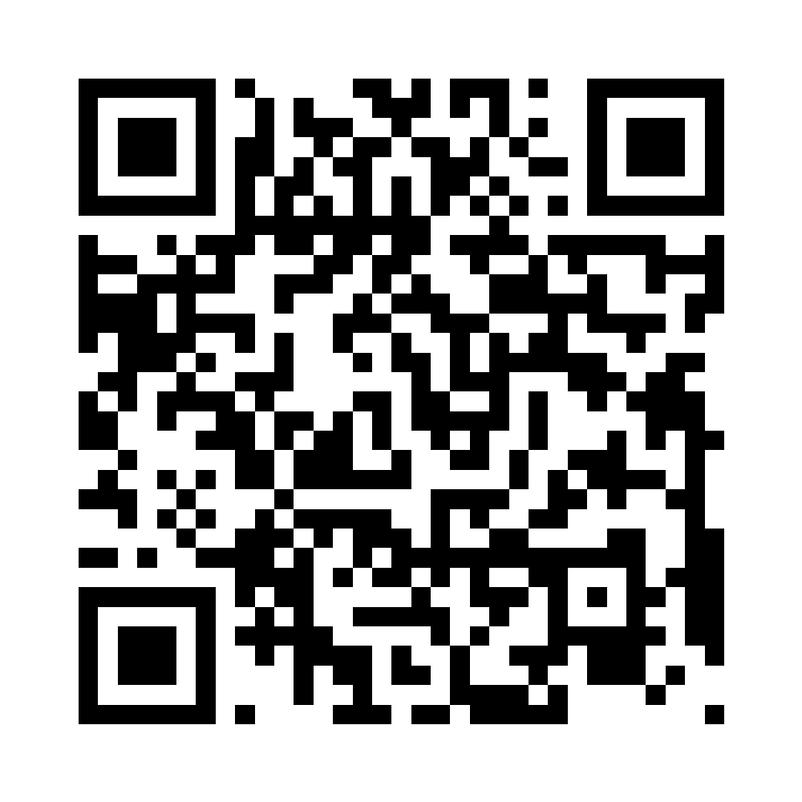
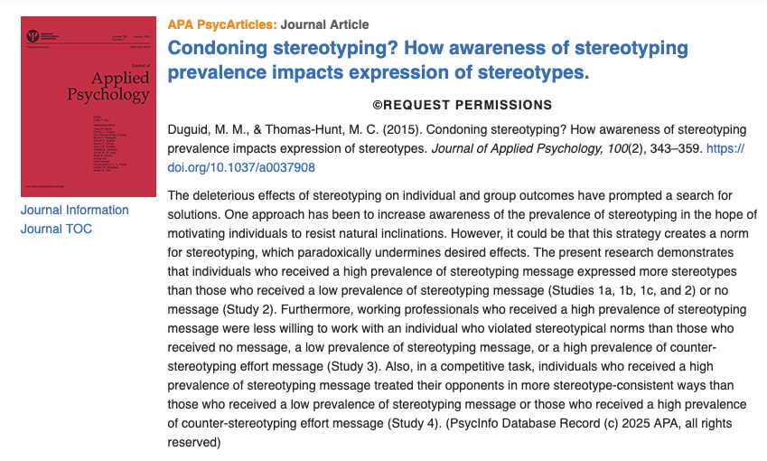
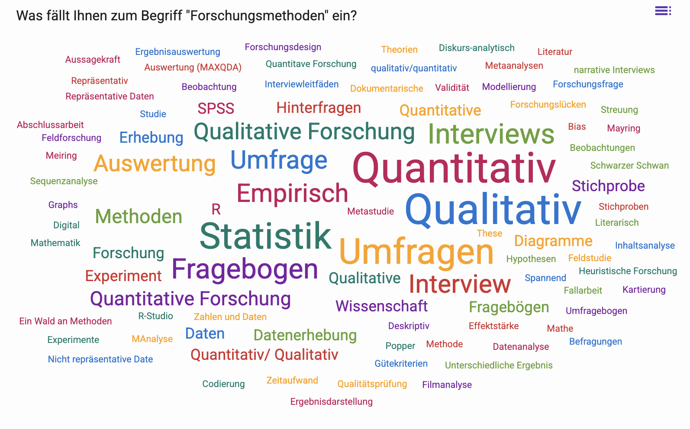
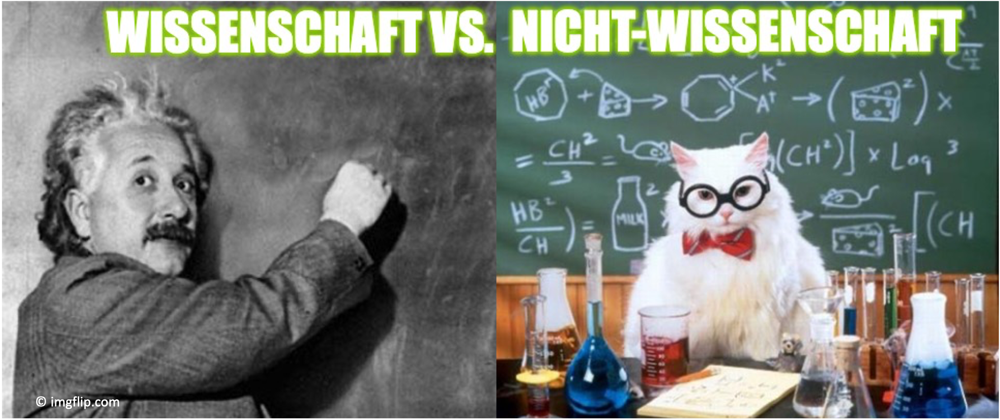
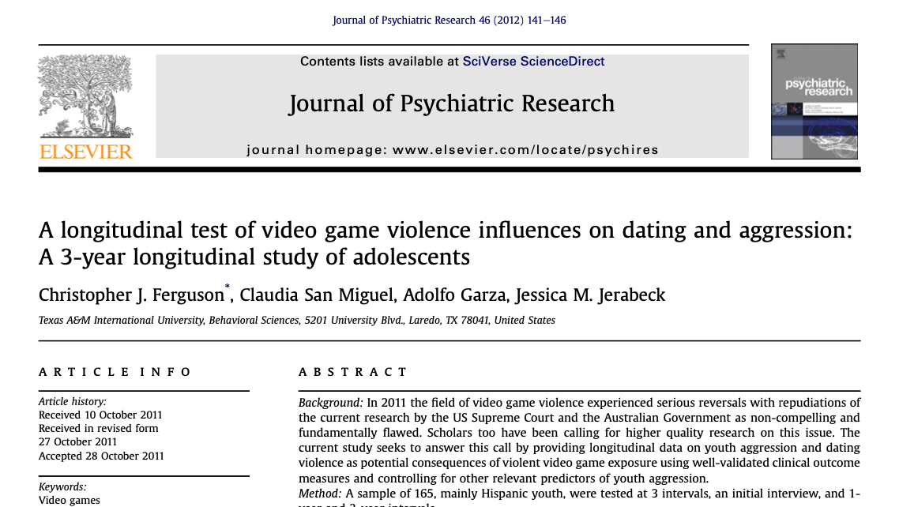
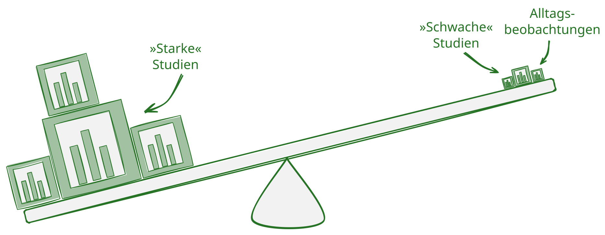
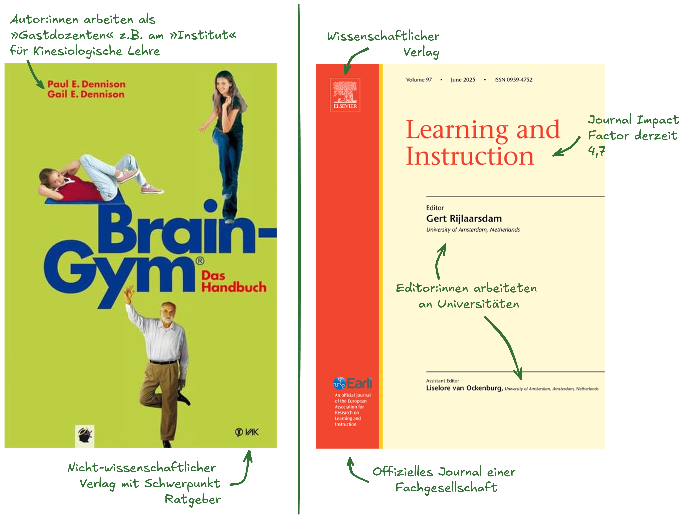
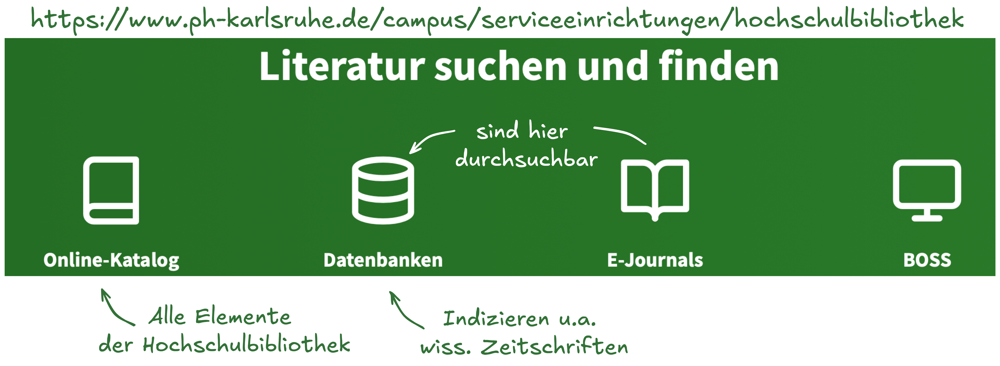

## Herzlich willkommen!  []{.imp} {.center}


```{r hidden chunk which creates template stuff}
#| echo: false

## in terminal ########
# quarto install extension quarto-ext/fontawesome
# quarto install extension schochastics/academicons
#

########################
library(fontawesome)
library(tidyverse)

# Change css to lecker PH green
if(!dir.exists("img"))
dir.create("img")
if(!dir.exists("css"))
dir.create("css")
fileConn<-file("css/custom.scss")
writeLines(c("/*-- scss:defaults --*/",
             "$link-color: #8cd000 !default;"), fileConn)
close(fileConn)
```

```{css}
.callout-title {background-color: #267326 !important;}

.imp {
  color: #267326;
}

.em08{
  font-size: .8em;
}
.em07{
  font-size: .7em;
}


figure>figcaption {
    margin-top: 0.5em;
    text-align: center;
}

.citation {
  font-size267326.8em;
  color: #267326;
}


.timevis.html-widget .vis-background .vis-minor.vis-odd {
  background: #26732630;
  }
  
.vis-text {
  color: #267326 !important;
  }
  
.vis-timeline {
  border: transparent;
  }
  
.vis-item {
  border-color: #267326; 
  background-color: #267326; 
  color: #ffffff !important;
}


.vis-current-time {
  background-color: #8CD00000;
}
  
```


## Einstieg mit Particify {.large .center}

{width="30%" fig-align="center"}

::: {style="text-align: center;"}
[https://partici.fi/27244879](https://partici.fi/27244879)
:::


## Umweltbildung wirkt! {.smaller}

Ergebnisse von van de Wetering et al. [-@van_de_wetering_does_2022]

* Meta-Analyse basierend auf 169 Studien (512 Effektstärken, 176.000 Teilnehmende)
* Ergebnis: Environmental Education verbesserte im Mittel...

  * Umweltwissen (g = 0.953)
  * Einstellungen (g = 0.384)
  * Verhaltensabsichten (g = 0.256)
  * tatsächliches Verhalten (g = 0.410)

## ... oder doch nicht? {.smaller}

Zeitgleich:

* große Streuung der Effekte 
* häufig Selbstberichte statt Verhalten (betrifft 87 % der Effektstärken)
* Hinweise auf Publikationsbias


## Aber: Diversity-Trainings wirken! {.smaller}

* laut eines Systematic Reviews von Metinyurt et al. [-@metinyurt_systematic_2021]
* Beispiel: "evidence-based bias habit-breaking training" erhöht Awareness der Teilnehmenden für Vorurteile und implizite Biases [@bursell_scope_2024]

## ... manchmal {.smaller}

* oft keine Effekte auf relevante Outcomes (bspw. die tatsächlichen impliziten Biases [@bursell_scope_2024])
* viele Diversity-Trainings zeigen gar keine Effekte [@kalev_best_2006]
* teilweise können Trainings hingegen "backfiren" [@duguid_condoning_2015]

. . .

{width="60%"}


## Warum unterschiedliche Antworten?

(1) Unterschiedliche Outcomes: Wissen vs. Verhalten

. . . 

(2) Unterschiedliche Designs: Experiment / Querschnitt / ...

. . . 

(3) Unterschiedliche Messungen: Selbstberich vs. tatsächliches Verhalten

. . .

(4) Unterschiedliche Kontexte: Zielgruppen, Dauer, Setting


## Quintessenz {.larger .center}

Nicht die Realität widerspricht sich - sondern die Methoden erzeugen unterschiedliche Antworten


## Heutige Vorlesung {.large .center}
<br> 
[]{.imp} Motivierung: Warum _Forschungsmethoden_?

. . . 

[]{.imp} Kurzvorstellung(en)

. . . 

[]{.imp} Organisatorische Einführung

. . . 

[]{.imp} Was ist Wissenschaft?

. . . 


[]{.imp} Ihre Fragen


## <!--Kurzvorstellung(en)--> {.center}
### []{.imp} Cora Parrisius 
<br> 

```{r, echo = F, warning=FALSE}
library(timevis)
data <- data.frame(
  id      = 1:4,
  content = c("Item one", "Item two",
              "Ranged item", "Item four"),
  start   = c("2016-01-10", "2016-01-11",
              "2016-01-20", "2016-02-14 15:00:00"),
  end     = c(NA, NA, "2016-02-04", NA)
)

data <- data.frame(
  #id      = 1:4,
  content = c("Erstes SE",
              "Promotion Tü", "Jun. Prof. KA"),
  start   = c("2017-05-01",
              "2020-10-01", "2022-10-01"),
  end     = c(rep(NA, 3))
)

timevis(data, 
        loadDependencies = F, 
        showZoom = F,
        fit = T,
        height = "400px")
```


## []{.imp} Cora Parrisius 

**Sprechstunde**

* Mittwochs, 14:30 - 15 Uhr
* Anmeldung: [https://t1p.de/parrisius-sprechstunde](https://t1p.de/parrisius-sprechstunde)
* Raum: 2.B302 oder WebEx


**Erreichbarkeit**

* via Email: [fome-lehre@ph-karlsruhe.de](mailto:fome-lehre@ph-karlsruhe.de)


## <!--Kurzvorstellung(en)--> {.center}
### []{.imp} Und Sie

<br>


{width="30%" fig-align="center"}

::: {style="text-align: center;"}
[https://partici.fi/27244879](https://partici.fi/27244879)
:::


## <!--Begriff Forschungsmethoden-->




## <!--Organisatorische Einführung-->[ Organisatorische Einführung]{.imp} {.center}


## Organisatorische Einführung []{.imp} {.smaller .center}

> Spielregeln

:::: {.columns}

::: {.column width="50%"}
Die Vorlesung...

* wächst organisch
* hängt davon ab, was Sie einbringen
* lebt von Beteiligung

:::


::: {.column width="50%"}


{width="50%"}

InnovationSpace-Kurs mit Folien: [https://t1p.de/parrisius-012](https://innovationspace.ph-karlsruhe.de/course/view.php?id=712)

:::

::::

## Studienleistung: Klausur {.smaller}
* 1 **obligatorische** Klausur 
   * 90 Minuten 
   * Modalitäten werden noch verkündet
   * Während offiz. Prüfungszeitraum
   

## <!--Wissenschaft vs. Nicht-Wissenschaft--> {.center}
[ Wissenschaft vs. Nicht-Wissenschaft]{.em15 .c .imp}

## Das Abgrenzungsproblem {.smaller auto-animate=true .center}



## Das Abgrenzungsproblem {.smaller auto-animate=true}

:::: {.columns}

::: {.column width='80%'}
Wer wissenschaftliche Forschung („scientific research") betreibt, sucht mithilfe [anerkannter wissenschaftlicher Methoden und Methodologien]{.imp} auf der Basis des [bisherigen Forschungsstandes]{.imp} (d. h. vorliegender Theorien und empirischer Befunde) [zielgerichtet]{.imp} nach gesicherten neuen Erkenntnissen, [dokumentiert]{.imp} den Forschungsprozess sowie dessen Ergebnisse [in nachvollziehbarer Weise]{.imp} und stellt die Studie in Vorträgen und Publikationen der [Fachöffentlichkeit]{.imp} vor [@doering2016].<br><br>
:::

::: {.column width='20%'}
<br><br><br1
>
<center></center>
:::

::::

::: {.callout-tip icon=false collapse="false"}
##  Weiterführende Literatur
Lakatos, I. (1977). The methodology of scientific research programmes: Philosophical papers Volume I. Cambridge University Press.  
Kuhn, Thomas S. (1962). The structure of scientific revolutions. University of Chicago Press.    
Popper, K. (1989). Logik der Forschung. Mohr.
:::


## Nicht-Wissenschaft Bsp. 1: {.smaller .center}

> [Practical Wisdom]{.imp}. Beispielsweise stellt der Tipp eines Betreuungslehrers - *lernen Sie schnell die Vornamen, das wird das Classroommanagement schnell erleichtern* - Nicht-Wissenschaft dar.

. . .

<br> Wer wissenschaftliche Forschung („scientific research") betreibt,
sucht mithilfe [anerkannter wissenschaftlicher Methoden und
Methodologien]{.imp} <i class="fa fa-times-circle"></i> auf der Basis
des [bisherigen Forschungsstandes]{.imp}
<i class="fa fa-times-circle"></i> (d. h. vorliegender Theorien und
empirischer Befunde) [zielgerichtet]{.imp}
<i class="fa fa-times-circle"></i> nach gesicherten neuen Erkenntnissen,
[dokumentiert]{.imp} <i class="fa fa-times-circle"></i> den
Forschungsprozess sowie dessen Ergebnisse [in nachvollziehbarer
Weise]{.imp} <i class="fa fa-times-circle"></i> und stellt die Studie in
Vorträgen und Publikationen der [Fachöffentlichkeit]{.imp}
<i class="fa fa-times-circle"></i> vor.


## Nicht-Wissenschaft Bsp. 2: {.smaller .center}

> [Datenbasierte Schulentwicklung]{.imp}. Beispielsweise stellt eine Befragung von Eltern zu einer geplanten Schulmensa trotz »perfektem Fragebogen & optimaler Auswertung« Nicht-Wissenschaft dar.

. . .

<br> Wer wissenschaftliche Forschung („scientific research") betreibt,
sucht mithilfe [anerkannter wissenschaftlicher Methoden und
Methodologien]{.imp} <i class="fa fa-check-circle"></i> auf der Basis
des [bisherigen Forschungsstandes]{.imp}
<i class="fa fa-times-circle"></i> (d. h. vorliegender Theorien und
empirischer Befunde) \[zielgerichtet\]
<i class="fa fa-check-circle"></i> nach gesicherten neuen Erkenntnissen,
[dokumentiert]{.imp} <i class="fa fa-times-circle"></i> den
Forschungsprozess sowie dessen Ergebnisse [in nachvollziehbarer
Weise]{.imp} <i class="fa fa-times-circle"></i> und stellt die Studie in
Vorträgen und Publikationen der [Fachöffentlichkeit]{.imp}
<i class="fa fa-times-circle"></i> vor.

## <!--Kriterien der wiss. Qualität --> {.center}
[ Kriterien der wiss. Qualität]{.em15 .c .imp}

## Warum Wiss. Qualität evaluieren? {.smaller}

:::: {.columns}

::: {.column width='30%'}



::: {style="font-size: 50%; text-align:center;"}
Widersprüchliche Ergebnisse aus Anderson et al. -@anderson2008 und Ferguson et al. -@ferguson2012a.
:::

:::

::: {.column width='70%'}
Es gibt zu jeder Forschungsfrage widersprüchliche Studien [@smaldino2016]: Es gibt Astronomen, die schreiben die Erde sei flach und Klimawissenschaftler, die überzeugt sind es gäbe keinen Klimawandel etc. Dennoch gilt es als wissenschaftlicher Konsens, dass die Erde (annähernd) rund und der Klimawandel anthropogen ist. Dieser Konsens entsteht, wenn man sich zunächst (a priori. also bevor man die Studienergebnisse sichtet) auf Qualitätskriterien für Studien einigt und dann die scheinbar widersprüchlichen Ergebnisse -- gewichtet um deren Qualität -- zusammenfasst.

{width="50%" fig-align="center"}
:::

::::

## Wissenschaftliche(re) Literatur finden {.smaller}
* Um »starke Studien« (verglw.) sicher zu identifizieren und wissenschaftlichere von weniger wissenschaftlicherer Literatur zu unterscheiden, muss man die Methoden einer Studie verstehen und Alternativen kennen [sog. First Hand Evaluation, siehe Bromme & Goldman -@bromme2014d]
* Da dazu jahrelanger Aufbau von Expertise notwendig ist, lohnt es sich auch anhand folgender sekundärer Kriterien zu bewerten (Second-Hand Evaluation)
    * Sind die Autor:innen an Universitäten/Hochschulen tätig?
    * Handelt es sich um einen wissenschaftlichen Verlag?
    * Führt die Zeitschrift ein Peer-Review-Verfahren durch?
    * Ist das Publikationsorgan im Social-Science Citation Index indiziert?
    * Wird das Publikationsorgan von einer großen wissenschaftlichen Gesellschaft getragen?
    * Wie oft werden Beiträge des Organs in indizierten Organen zitiert?

## Wissenschaftliche(re) Literatur finden {.smaller}
{width=60%}

## Wissenschaftliche(re) Literatur finden {.smaller}



## Ihre Fragen {.center}


## Literatur
<style>
div.callout {border-left-color: #267326 !important;
</style>