## Inhalte dieses Vorlesungsblocks {.center}

```{r hidden chunk which creates template stuff}
#| echo: false

## in terminal ########
# quarto install extension quarto-ext/fontawesome
# quarto install extension schochastics/academicons
#

########################
library(fontawesome)
library(tidyverse)
set.seed(848265)
```


. . .

[]{.imp} Der quantitative Forschungsprozess 

. . .  

[]{.imp} Was ist eine Messung?

. . .

[]{.imp} Gütekriterien einer Messung

. . .

[]{.imp } Erhebungsverfahren


## <!--Der quantitative Forschungsprozess--> {.center}
[ Der quantitative Forschungsprozess]{.em15 .c .imp}

## Charakteristika quantitativer Forschung

Quantitative Forschung zielt auf **Messung**, **Vergleich** und **Verallgemeinerung**. Sie arbeitet mit numerischen Daten, statistischen Verfahren und strebt nach Repräsentativität.

## Neun-Phasen-Modell {.smaller}
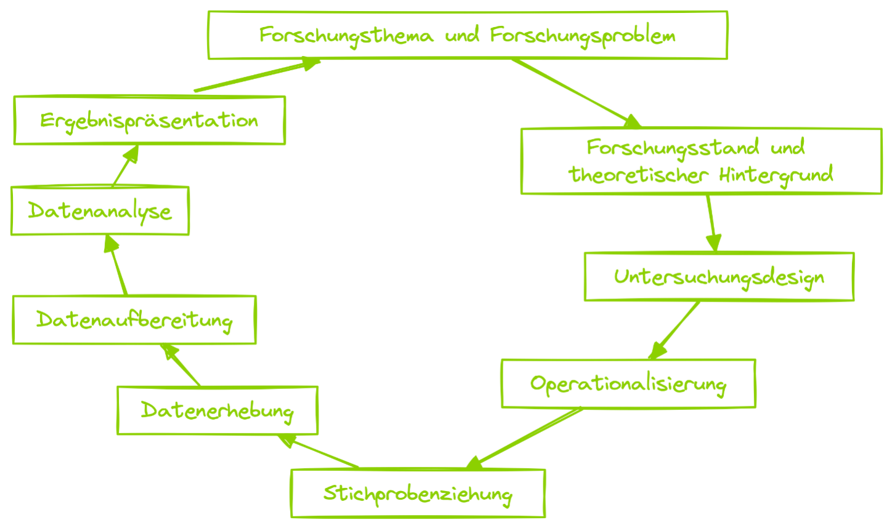

## Neun-Phasen-Modell {.smaller}

* sequenziell
* gründliche theoretische und empirische Vorarbeit besonders wichtig, da im Laufe des Prozesses nicht mehr nachgearbeitet werden kann
* trotz sequenzieller Abarbeitung starke Verzahnung der Phasen


## 1. Forschungsthema {.smaller}

> Jede Studie beginnt mit der Entscheidung für ein **Forschungsthema** und der Konkretisierung eines relevanten **Forschungsproblems**. Zu diesem sind dann detailliertere **Forschungsfragen** bzw. **Forschungshypothesen** zu formulieren, wobei der aktuelle Forschungsstand sowie ein Theoriemodell zugrunde zu legen sind. [@doering2023]

## 2. Forsschungsstand und theoretischer Hintergrund {.smaller}

> Jede quantitativ-empirische Studie muss an den bisherigen **Forschungsstand** anknüpfen und einen **theoretischen Rahmen** vorgeben, um den interessierenden Sachverhalt zu untersuchen. Notwendige Voraussetzung ist eine gründliche Recherche und Aufarbeitung der Fachliteratur zum Forschungsthema. Zudem muss **Theoriearbeit** in dem Sinne geleistet werden, dass aus der Fülle theoretischer Ansätze die für das Forschungsproblem leistungsfähigsten ausgewählt, modifiziert und/oder miteinander zu einem Theoriemodell verknüpft werden, aus dem Forschungsfragen bzw. Forschungshypothesen abzuleiten sind. [@doering2023]

## 3. Untersuchungsdesign {.smaller .scrollable}

> Bei quantitativen sozialwissenschaftlichen Untersuchungen unterscheiden wir je nach Erkenntnisinteresse drei Typen von Studien (deskriptiv, explorativ, explanativ). Je nach konkreten inhaltlichen Forschungsfragen bzw. Forschungshypothesen muss die Studie unterschiedlich angelegt sein; damit ist das Untersuchungsdesign gemeint. Es ist in verschiedener Hinsicht zu konkretisieren, etwa
hinsichtlich Untersuchungsort (Feld- vs. Laborstudie), Untersuchungszeitpunkten (Querschnitt- vs. Längsschnittstudie), Herkunft der Daten (Primär- vs. Sekundäranalyse), Behandlung der Untersuchungspersonen (experimentelle vs. quasi-experimentelle vs. nicht-experimentelle Studie) etc. Die präzise und sachgerechte Ausarbeitung des Untersuchungsdesigns entscheidet darüber, ob die Studie a) praktisch mit den vorhandenen Mitteln durchführbar ist und b) zu aussagekräftigen Resultaten hinsichtlich des Forschungsproblems führt. [@doering2023]

Reminder: 

* **deskriptive** Studien: sollen die Verteilung oder Ausprägung bestimmter Merkmale in
definierten Bevölkerungsgruppen feststellen.
* **explorative** Studien: sollen einen wenig erforschten
Sachverhalt detailliert beschreiben und zur Theoriebildung beitragen.
* **explanative** Studien: sollen theoretisch wohlbegründete Hypothesen anhand von Daten testen.


## 4. Operationalisierung {.smaller}

> Alle im Rahmen der zu prüfenden Hypothesen bzw. zu beantwortenden Forschungsfragen relevanten Merkmale
der Erfahrungswirklichkeit müssen präzise **definiert** und in ihren wichtigen **Aspekten bzw. Dimensionen entfaltet werden (Konzeptspezifikation)**. Auf dieser Basis muss dann festgelegt werden, wie die Merkmale bzw. ihre Ausprägungen zu **messen** sind, damit sich aussagekräftige quantitative Daten ergeben. Mit der Operationalisierung wird gleichzeitig das **Skalenniveau** der Variablen festgelegt und damit der Informationsgehalt der Daten sowie ihre statistischen Auswertungsmöglichkeiten. [@doering2023]


## 5. Stichprobenziehung {.smaller}

> Zunächst ist zu entscheiden, ob die gesamte Population (**Vollerhebung**) oder nur ein Ausschnitt (**Stichprobenerhebung**) untersucht werden soll. Bei der Stichprobenziehung sind (1) die **Stichprobenart** (zufällige oder nicht-zufällige Auswahl) sowie (2) der **Stichprobenumfang** entscheidend für die Aussagekraft der Studie.
Der Stichprobenplan muss durch eine geeignete Sammlung von Untersuchungseinheiten bzw. **Rekrutierung** von
Untersuchungspersonen umgesetzt werden. [@doering2023]

## 6. Datenerhebung {.smaller}

Für die Erhebung quantitativer Daten stehen in den Human- und Sozialwissenschaften eine Reihe von **Datenerhebungsmethoden** zur Verfügung:

* Strukturierte Beobachtung
* Strukturierte mündliche Befragung (Interview)
* Strukturierte schriftliche Befragung (Fragebogen)
* Psychologischer Test
* Physiologische Messung
* Quantitative Dokumentenanalyse bzw. Inhaltsanalyse


Um quantitative Daten auf diese Weise zu erheben, müssen zuvor im Zuge der Operationalisierung **standardisierte
Erhebungsinstrumente** (Beobachtungsplan, Interviewleitfaden, Fragebogen, Kategoriensystem etc.) entwickelt
worden sein. Zudem wird zur Datenerhebung in der Regel auch **geschultes Personal** (z. B. Interviewer, Kodierer) und mehr oder minder viel Zeit benötigt. [@doering2023]

## 7. Datenaufbereitung {.smaller}

> Das erhobene **Rohdatenmaterial** muss vor der Datenanalyse sorgfältig aufbereitet werden (z. B. Sortierung, Bereinigung um Fehler, Anonymisierung, Prüfung der Messgenauigkeit etc.). Nach der Datenbereinigung stehen vollständige, fehlerfreie und kommentierte Datensätze zur Verfügung, meist in elektronischer Form. [@doering2023]

## 8. Datenanalyse {.smaller}

> Die quantitative Datenanalyse erfolgt computergestützt über Tabellenkalkulationsprogramme oder spezielle **Statistik-Software** (z. B. SPSS; R). Die Analysestrategie hängt vom Untersuchungstyp ab.
Die Datenanalyse mündet in eine **Interpretation der Befunde**: Die einzelnen Forschungsfragen werden beantwortet bzw. die Forschungshypothesen geprüft, eine Gesamtaussage über das zugrunde gelegte Theoriemodell und den Untersuchungsgegenstand wird getroffen, die Grenzen der Aussagekraft der Studie werden hervorgehoben und
Schlussfolgerungen für die zukünftige Forschung sowie für die Praxis gezogen. [@doering2023]

## 9. Ergebnispräsentation {.smaller}

> Die Ergebnisse empirischer Studien werden der Scientific Community mittels **Zeitschriftenartikeln**, **Konferenzvorträgen** und **Postern**
präsentiert, die jeweils einen **Peer-Review-Prozess** (Begutachtung durch Fachkolleg:innen) durchlaufen.
Darüber hinaus existieren weitere Veröffentlichungsmöglichkeiten (z. B. Bücher, Vorträge), die keiner Qualitätskon-
trolle durch Kolleg:innenbegutachtung unterliegen. Die Kommunikation wissenschaftlicher Ergebnisse an die **breite
Öffentlichkeit** etwa durch Internetpräsenzen, Presseinterviews oder populärwissenschaftliche Beiträge gewinnt an
Bedeutung. [@doering2023]

## <!--Was ist eine Messung--> {.center}
[ Was ist eine Messung?]{style="font-size: 1.5em;"}

## Messung als Homomorphismus {.smaller}
::: {style="font-size:.8em;"}
> Eine Messung („measurement“) meint in der quantitativen Sozialforschung eine [Zuordnung von Objekten zu Zahlen]{.imp}, sofern diese Zuordnung eine [homomorphe (strukturerhaltende) Abbildung]{.imp} eines empirischen Relativs in ein numerisches Relativ ist [@orth1983].
:::

::: {.r-stack}
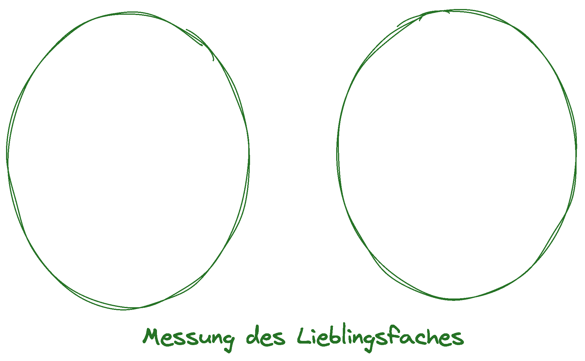{.fragment width="60%" fig-align="center"}

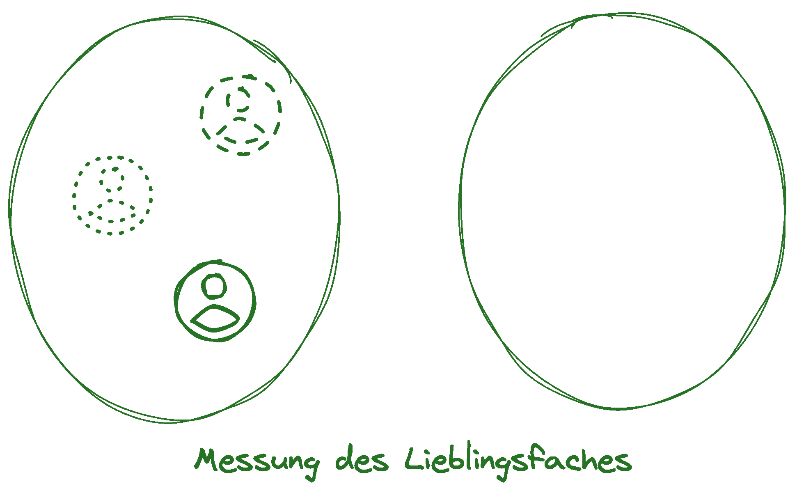{.fragment width="60%" fig-align="center"}

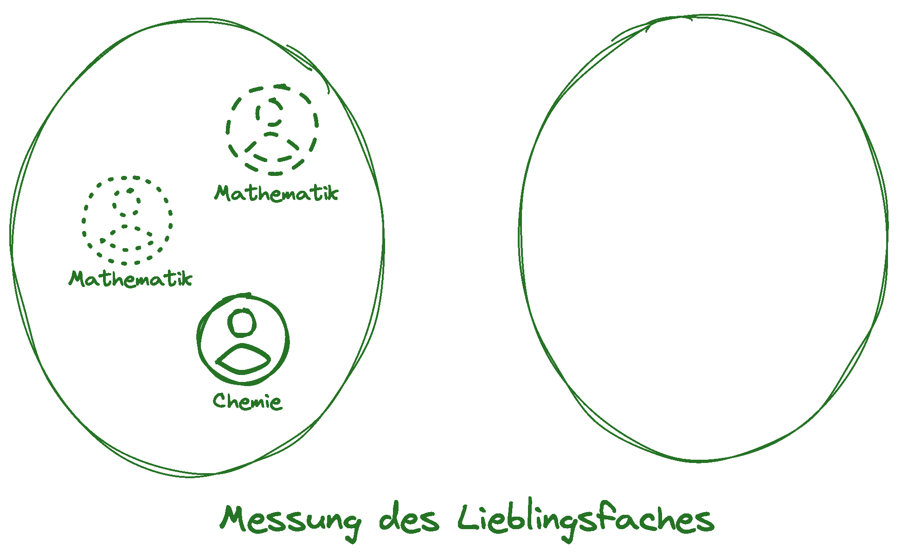{.fragment width="60%" fig-align="center"}

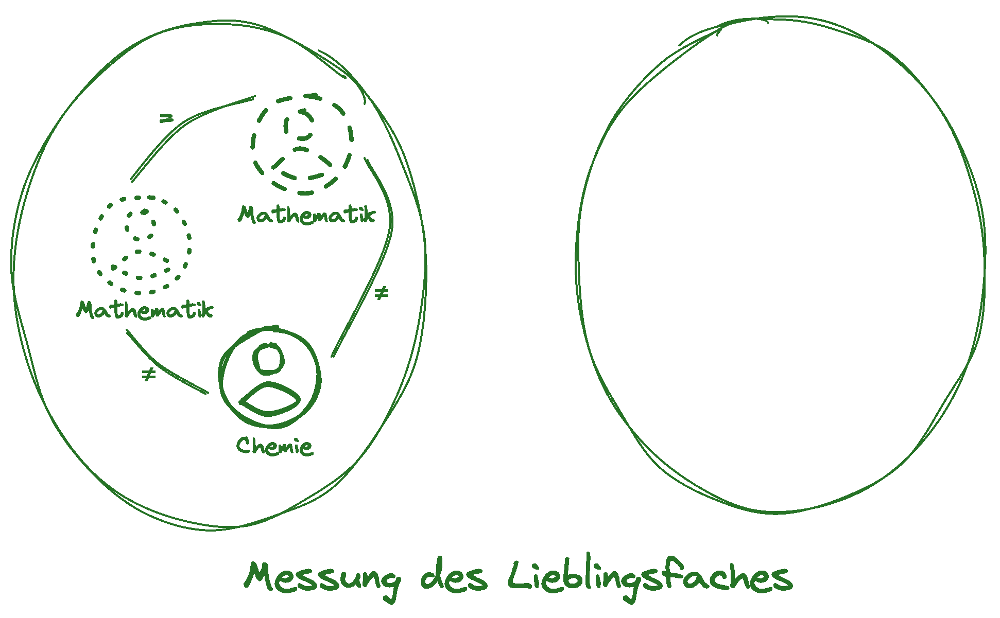{.fragment width="60%" fig-align="center"}

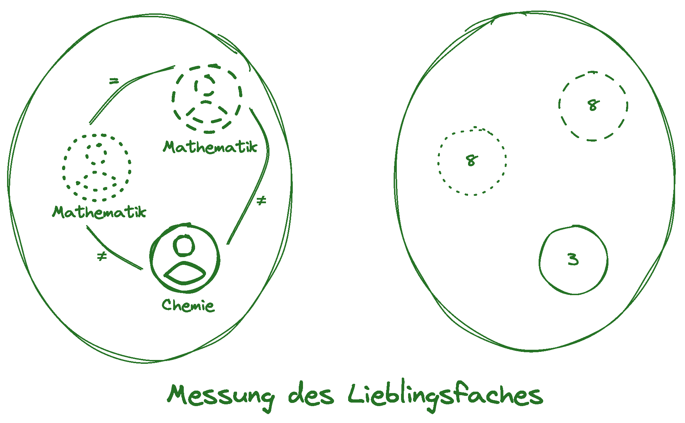{.fragment width="60%" fig-align="center"}

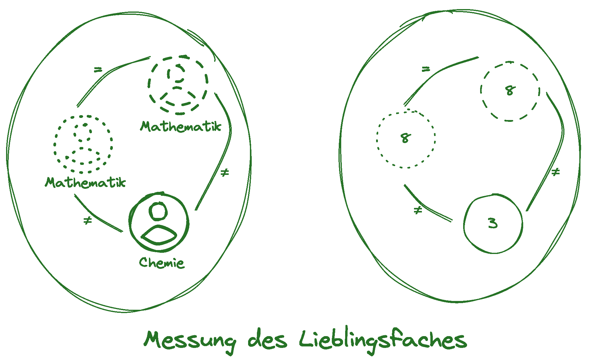{.fragment width="60%" fig-align="center"}

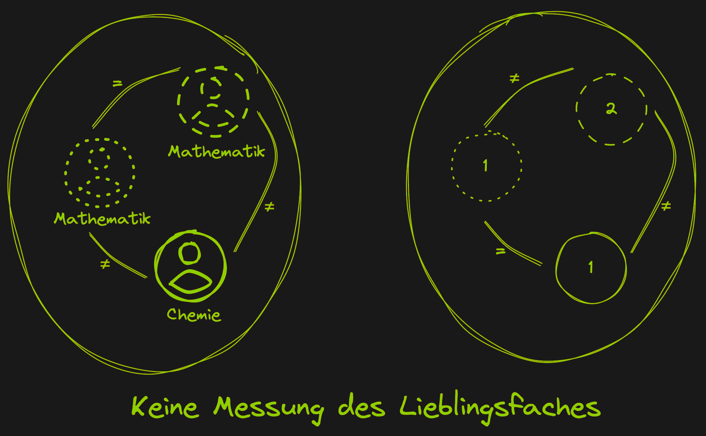{.fragment width="60%" fig-align="center"}
:::

## Messung als Homomorphismus {.smaller .center}

::: {.r-stack}

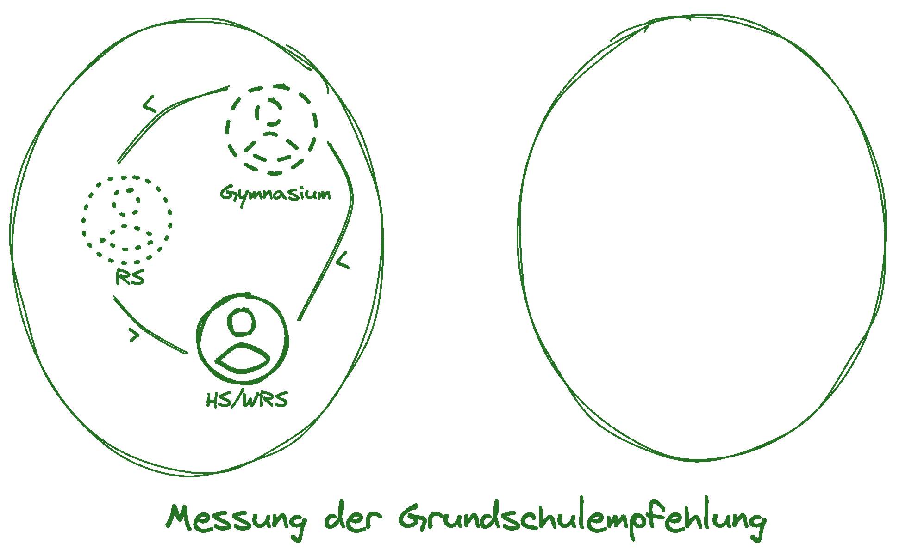{.fragment width="60%" fig-align="center"}

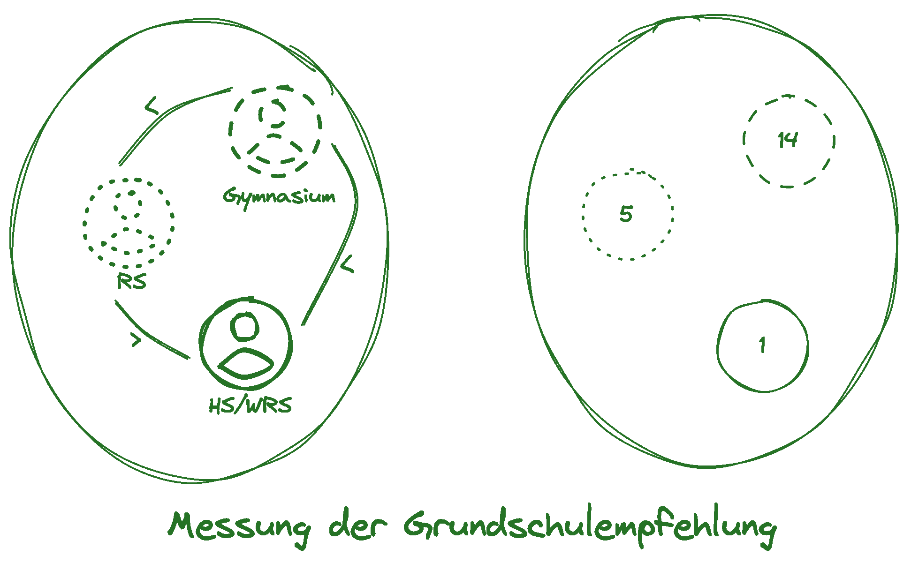{.fragment width="60%" fig-align="center"}

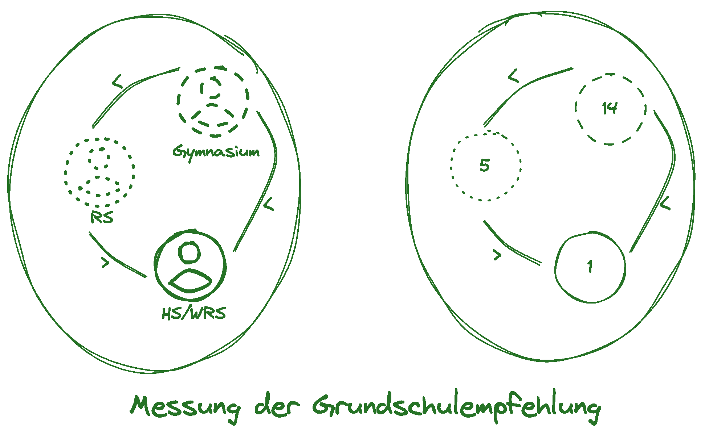{.fragment width="60%" fig-align="center"}

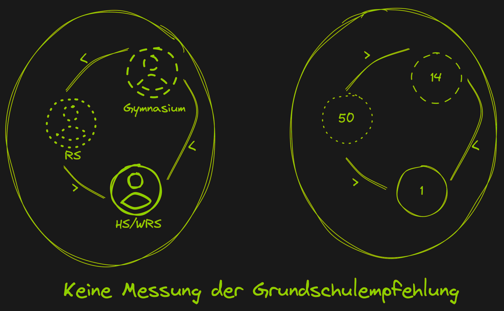{.fragment width="60%" fig-align="center"}
:::
. . .

::: {.callout-tip icon=false collapse="false"}
##  Weiterführende Literatur
Eid, M., Gollwitzer, M., & Schmitt, M. (2013). Statistik und Forschungsmethoden: Lehrbuch. Mit Online-Materialien. Beltz.
Steyer, R., & Eid, M. (2013). Messen und Testen. Springer-Verlag.
:::


## <!--Typologien von Variablen--> {.center}
[ Typologien von Variablen]{style="font-size: 1.5em;"}

## Typologie I: Skalenniveaus {.smaller .center auto-animate="true"}
> Das Skalenniveau einer Variable beschreibt, welche Relationen im numerischen Relativ sinnvoll sind [@doering2016].  

<br>

```{r}
tibble(Skalenniveau = c("Nominalskala", "Ordinalskala", "Intervallskala"),
         `Sinnvolle Relationen` = c("Gleichheit", "Gleichheit + Ordnung", 
                                    "Gleichheit + Ordnung + Abstand"),
         `Beispiel` = c("Lieblingsfach", "Grundschulempfehlung", 
                        "tägl. Internetnutzung")) |> 
  knitr::kable()
```


## Aufgabe
<center>
<iframe width="980" height="500" src="Integrierte Aufgaben/skalenniveau-erkennen.html" title="Aufgabe"></iframe>
</center>


## Typologie II: Inferenzniveau {.smaller .center}
> Das Inferenzniveau einer Variable beschreibt, in welchem Ausmaß bei einer Messung geschlussfolgert/abstrahiert wird [@lotz2013a]. Da Werte im numerischen Relativ immer schlussfolgernd interpretiert werden müssen, macht es mehr Sinn von höh**er**inferenten/niedrig**er**inferenten Variablen zu sprechen als von hochinferenten/niedriginferenten Variablen.

<br>

:::: {.columns}

::: {.column width='50%'}
#### Niedrigerinferentere Variablen
* Sind mehr oder weniger direkt beobachtbar
* _Beispiel: "Anzahl der Fehltage einer Schülerin"_
:::

::: {.column width='50%'}
#### Hochinferentere Variablen
* Sind nicht direkt beobachtbar
* _Beispiel: "Kognitive Aktivierung"_
:::

::::

## Aufgabe
<center>
<iframe width="980" height="500" src="Integrierte Aufgaben/inferenzniveauunterschied-erkennen.html" title="Aufgabe"></iframe>
</center>


## [Typologie  III: Theo. Kausalzusammenhang]{style="font-size:0.9em"} {.smaller}
::: {.fragment fragment-index=4}
Als **abhängige Variable (AV)** wird eine (kausal) beeinflusste Variable bezeichnet, während die **unabhängige Variable (UV)** die beeinflussende Variable darstellt. Eine **Mediatorvariable (MeV)** ist zugleich AV und UV. Beeinflusst eine Variable eine Wirkung bezeichent man sie als **moderierende Variable (MoV)** [@eid2013]
:::

::: {.r-stack}
{.fragment fragment-index=1 width="80%" fig-align="center"}

{.fragment fragment-index=2 width="80%" fig-align="center"}

{.fragment fragment-index=3 width="80%" fig-align="center"}
:::

::: {.fragment fragment-index=5}
::: {.callout-tip icon=false collapse="false"}
##  Weiterführende Literatur
Pearl, J., Glymour, M., & Jewell, N. P. (2016). Causal inference in statistics: A primer. Wiley.
:::
:::

## Aufgabe
<center>
<iframe width="980" height="500" src="Integrierte Aufgaben/av-identifizieren.html" title="Aufgabe"></iframe>
</center>

## Aufgabe
<center>
<iframe width="1280" height="500" src="Integrierte Aufgaben/av-uv-mov-identifizieren-text.html" title="Aufgabe"></iframe>
</center>

## <!--Gütekriterien einer Messung--> {.center}
[ Gütekriterien einer Messung]{style="font-size: 1.5em;"}

## Objektivität {.smaller .center}
> Zur Beschreibung der Objektivität einer Messung oder eines Tests wird typischerweise zwischen der [Durchführungsobjektivität]{.imp}, der [Auswertungsobjektivität]{.imp} und der [Interpretationsobjektivität]{.imp} differenziert [@doering2016], also der Unabhängigkeit des Ergebnisses der Messung/des Test von der durchführenden, auswertenden bzw. interpretierenden Person.

<br>

::: {.r-stack}
{.fragment fragment-index=1 width="110%" fig-align="center"}

{.fragment fragment-index=2 width="110%" fig-align="center"}

{.fragment fragment-index=3 width="110%" fig-align="center"}
:::


## Reliabilität {.center .smaller}
> Reliabilität ist das Ausmaß an Messfehlerfreiheit

<br>

::: {.r-stack}
{.fragment fragment-index=1 width="120%" fig-align="center"}

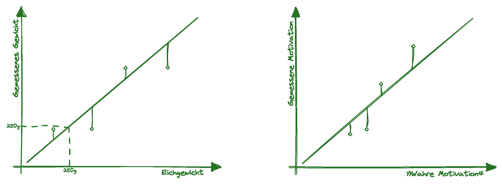{.fragment fragment-index=2 width="120%" fig-align="center"}
:::

## Validität {.center .smaller}
::: {.fragment}
####  Kriteriumsvalidität
"Ein Test weist Kriteriumsvalidität auf, wenn vom Verhalten der Testperson innerhalb der Testsituation erfolgreich auf ein »Kriterium«, nämlich auf ein Verhalten außerhalb der Testsituation, geschlossen werden kann" [@moosbrugger2020].  
:::

## Validität {.center .smaller}

####  Konstruktvalidität
Das Ausmaß der theoretischen und empirischen Belege für die Angemessenheit der Interpretation von Testwerten [@cronbach1955].

<br>  


## Aufgabe
<center>
<iframe width="1280" height="500" src="Integrierte Aufgaben/guetekriterien-einer-messung-erkennen.html" title="Aufgabe"></iframe>
</center>


## <!--(Einige) Erhebungsverfahren der Sozialwissenschaften--> {.center}
[ (Einige) Erhebungsverfahren der Sozialwissenschaften]{style="font-size: 1.5em;"}

## (Externe) Beobachtung {.smaller .center}
Wissenschaftliche Beobachtung ist die systematische und [regelgeleitete Registrierung des Auftretens]{.imp} und der Ausprägung von ausgewählten, psychologisch relevanten Merkmalen oder Ereignissen. Sie folgt einem zuvor festgelegten Beobachtungsplan, der festlegt, [1)]{.imp} was beobachtet werden soll, [2)]{.imp} welche Aspekte weniger oder nicht relevant sind, [3)]{.imp} welchen Interpretationsspielraum der Beobachtende bei der Beobachtung hat , [4)]{.imp} wann, wie lange und wo die Beobachtung erfolgt und [5)]{.imp} auf welche Weise das Beobachtete registriert und protokolliert wird [@hussy2013]. 
<br> <br>

. . .


:::: {.columns}

::: {.column width='50%'}
#### Zentrale Vorteile
* Potentielle Vermeidung von Reaktanz
* Teilw. höhere Reliabilität
:::

::: {.column width='50%'}
#### Zentrale Nachteile
* Oft nicht ökonomisch
* Kognitive und psychische Variablen oft nur schwierig zugänglich
:::

::::


## Selbstauskünfte {.smaller .center}
Interview, Fragebögen und Tests stellen Beispiele für Selbstauskünfte dar.
<br> <br>

. . .


:::: {.columns}

::: {.column width='50%'}
#### Zentrale Vorteile
* Kognitive und psychische Variablen zugänglich
* Teilweise sehr ökonomisch
:::

::: {.column width='50%'}
#### Zentrale Nachteile
* Reaktanz oft höher
* Entwicklung von Fragebögen und Tests oft sehr aufwändig
:::

::::


## Physiologische Messung {.smaller .center}
Beispiele für physiologische Messungen im bildungswissenschaftlichen Bereich stellen die Messung der Hautleitfähigkeit und der Blickbewegungen dar.
<br> <br>

. . .


:::: {.columns}

::: {.column width='50%'}
#### Zentrale Vorteile
* Teilweise nur schwer verfälschbar
* Unbewusste Prozesse werden zugänglich
:::

::: {.column width='50%'}
#### Zentrale Nachteile
* Meist nicht verdeckt durchführbar
* Oft Laborbedingungen erforderlich
:::

::::


## Dokumentenanalyse {.smaller .center}
Bei der Dokumentenanalyse werden bereits existierende schriftliche Artefakte untersucht (z.B. Schriftliche Leitbilder, Klassentagebücher, Schriftwechsel, Homepages). Diese können sowohl in hoch- wie niedrigstrukturierten Prozessen gesammelt, transformiert und analysiert werden (quantitative und qualitative Dokumentenanalyse). 
<br> <br>

. . .


:::: {.columns}

::: {.column width='50%'}
#### Zentrale Vorteile
* Keine Genese von Daten notwendig
* Teilweise sehr ökonomisch
:::

::: {.column width='50%'}
#### Zentrale Nachteile
* Beschränkte Auswahl an Variablen 
* Artefakte müssen präexistieren
:::

::::


## Literatur
<style>
div.callout {border-left-color: #236327 !important;
</style>

