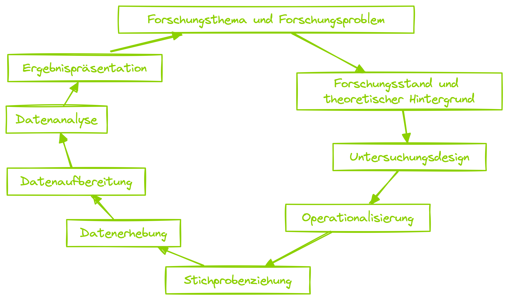
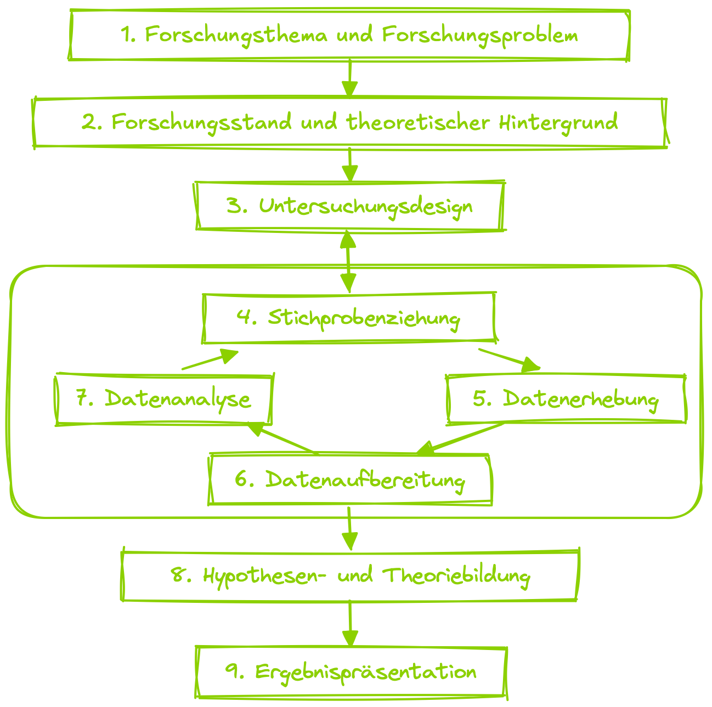
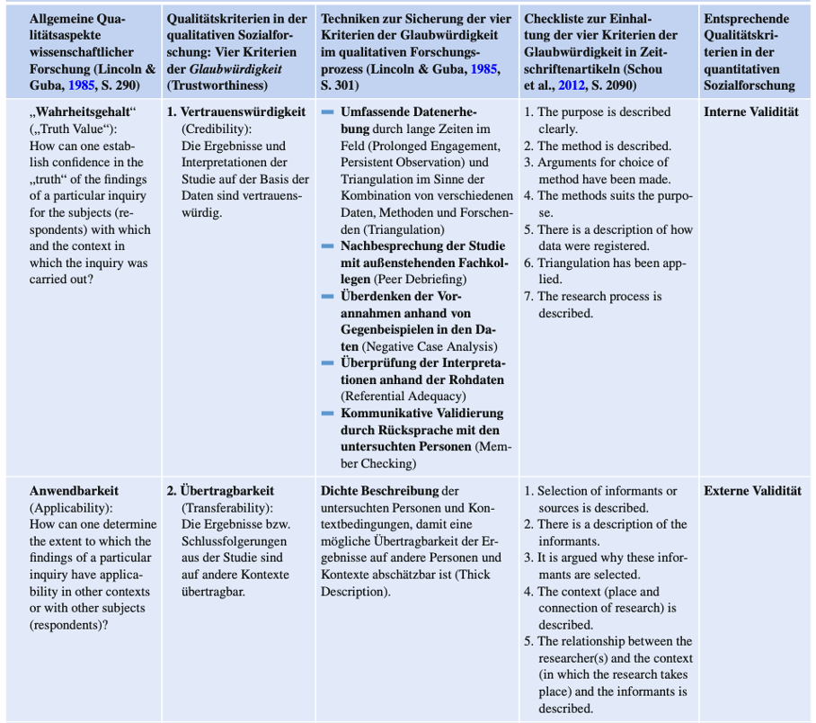
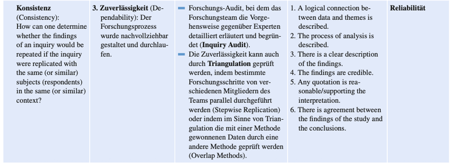
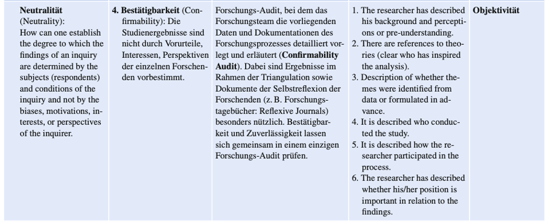
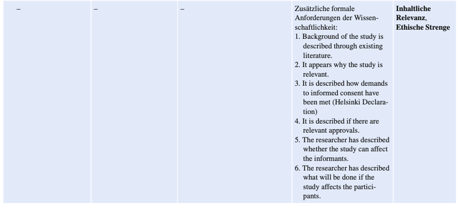
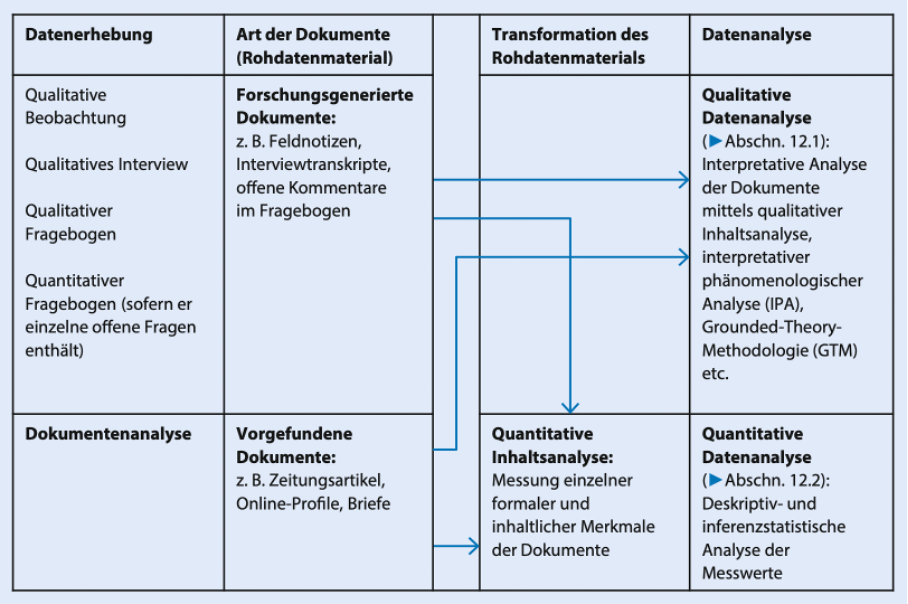

## Inhalte dieses Vorlesungsblocks {.center .smaller}

```{r hidden chunk which creates template stuff}
#| echo: false
#| cache: true

## in terminal ########
# quarto install extension quarto-ext/fontawesome
# quarto install extension schochastics/academicons
#

########################
library(fontawesome)
library(tidyverse)
set.seed(848265)

# Change css to lecker PH green
if(!dir.exists("img"))
dir.create("img")
if(!dir.exists("css"))
dir.create("css")
fileConn<-file("css/custom.scss")
writeLines(c("/*-- scss:defaults --*/",
             "$link-color: #8cd000 !default;",
             ".imp {color: #8cd000;}",
             ".em15 {font-size:1.5em;}",
             ".c {text-align: right !important;}",
             ".callout-title {background-color: #8cd000 !important;}",
             "#vcenter {vertical-align: middle;}"),
           fileConn)
close(fileConn)
```

. . .

[]{.imp} Der Qualitative Forschungsansatz

. . . 

[]{.imp} Der Qualitative Forschungsprozess

. . .

[]{.imp} Charakteristika und Sinnebenen qualitativer Forschung

. . .

[]{.imp} Bsp. qualitativer Forschung 

. . . 

[]{.imp} Gütekriterien für qualitative Forschung

. . . 

[]{.imp} Stichproben für qualitative Studien

. . . 

[]{.imp} Erhebungsmethoden

. . . 

[]{.imp} Analysemethoden


# []{.imp} Der Qualitative Forschungsansatz 

## Der Qualitative Forschungsansatz {.smaller}

> »Im qualitativen Forschungsansatz („qualitative research approach/strategy“) werden offene Forschungsfragen an wenigen Untersuchungseinheiten sehr detailliert mit unstrukturierten oder teilstrukturierten Datenerhebungsmethoden untersucht. Ziel ist eine Gegenstandsbeschreibung samt Theoriebildung. Die erhobenen qualitativen (nicht-numerischen, d. h. verbalen, visuellen) Daten werden interpretativ ausgewertet.« [@doering2023]

::: {.incremental}

* Qualitatives Paradigma steht in der Tradition der Geisteswissenschaften
*	Zielt primär auf eine verstehend-interpretative Rekonstruktion sozialer Phänomene in ihrem jeweiligen Kontext ab
*	Es kommt vor allem auf die Sichtweisen und Sinngebungen der Beteiligten an (Deutungsmuster, Prioritätensetzungen, Lebenserfahrungen, Ziele etc.)
*	Quantitatives und qualitatives Paradigma unterscheiden sich in ihrem Verständnis von Sozialwissenschaft, d.h. in ihren epistemologischen, ontologischen und	axiologischen Annahmen zum wissenschaftlichen Vorgehen

::: 

::: {.notes}

* epistemiologisch: sie gewinnen Wissen auf unterschiedliche Weise
* ontologisch: sie haben unterschiedliche Vorstellungen davon, was Realität überhaupt ist
* axiologisch: sie bewerten den Einfluss der Forschenden unterschiedlich

:::

## Der Qualitative Forschungsansatz {.smaller .scrollable}

**Epistemologie**
*(Erkenntnistheorie)*

> Wie kann Wissen gewonnen werden?

<br>

+-------------------------------+--------------------------------+
| **Quantitative Forschung**    | **Qualitative Forschung**      |
+===============================+================================+
| Wissen entsteht durch         | Wissen entsteht durch das      |
| objektive Messung,            | Verstehen von Bedeutungen,     |
| Beobachtung und               | Erfahrungen und sozialen       |
| Hypothesenprüfung.            | Zusammenhängen. Forschende     |
| Forschende sollen möglichst   | sind Teil des                  |
| unabhängig vom                | Erkenntnisprozesses.           |
| Untersuchungsgegenstand sein. |                                |
+-------------------------------+--------------------------------+

## Der Qualitative Forschungsansatz {.smaller .scrollable}

**Ontologie**
*(Lehre vom Sein bzw. von der Wirklichkeit)*

> Wie ist die Wirklichkeit beschaffen?

<br>

+-------------------------------+--------------------------------+
| **Quantitative Forschung**    | **Qualitative Forschung**      |
+===============================+================================+
| Es gibt eine objektive        | Wirklichkeit wird von Menschen |
| Realität, die unabhängig von  | unterschiedlich wahrgenommen   |
| den Menschen existiert und    | und sozial konstruiert. Es     |
| gemessen werden kann.         | können mehrere Wirklichkeiten  |
|                               | nebeneinander bestehen.        |
+-------------------------------+--------------------------------+

## Der Qualitative Forschungsansatz {.smaller .scrollable}

**Axiologie**
*(Lehre von Werten)*

> Welche Rolle spielen Werte in der Forschung?

<br>

+-------------------------------+-------------------------------------+
| **Quantitative Forschung**    | **Qualitative Forschung**           |
+===============================+=====================================+
| Forschung soll möglichst      | Werte und Perspektiven der          |
| wertfrei und neutral sein.    | Forschenden lassen sich nicht       |
| Persönliche Einstellungen der | vollständig ausschließen. Deshalb   |
| Forschenden sollen keinen     | werden sie reflektiert und          |
| Einfluss haben.               | transparent gemacht (Reflexivität). |
+-------------------------------+-------------------------------------+

## Der Qualitative Forschungsansatz {.smaller}

**Folge**:

* beide Paradigmen arbeiten mit unterschiedlichen Untersuchungsdesigns, Stichprobentypen, Datenerhebungs- und Datenauswertungsverfahren
* Qualitatives Paradigma ist als **Sammelbegriff** zu verstehen, der heterogene Menge unterschiedlicher expliziter und impliziter Wissenschaftstheorien, Forschungsstrategien und Denkstile umfasst (z.B. Hermeneutik, Dialektik, Phänomenologie, Praxeologie, Poststrukturalismus, Postmodernismus, Grounded-Theory-Methodologie)
* Daher werden üblicherweise abstrahierte Grundannahmen und Grundprinzipien, die weitgehend geteilt werden, dargestellt

## Zitate {.smaller}

>*»Der kleinste gemeinsame Nenner der qualitativen Forschungstraditionen lässt sich vielleicht wie folgt bestimmen: Qualitative Forschung hat ihren Ausgangspunkt im Versuch eines vorrangig deutenden und sinnverstehenden Zugangs zu der interaktiv „hergestellt“ und in sprachlichen wie nicht-sprachlichen Symbolen repräsentiert gedachten sozialen Wirklichkeit. Sie bemüht sich dabei, ein möglichst detailliertes Bild der zu erschließenden Wirklichkeitsausschnitte zu liefern. Dabei vermeidet sie so weit wie möglich, bereits durch rein methodische Vorentscheidungen den Bereich möglicher Erfahrung einzuschränken oder rationalistisch zu „halbieren“. Die bewusste Wahrnehmung und Einbeziehung des Forschers und der Kommunikation mit den „Beforschten“ als konstitutives Element des Erkenntnisprozesses ist eine zusätzliche, allen qualitativen Ansätzen gemeinsame Eigenschaft: Die Interaktion des Forschers mit seinen „Gegenständen“ wird systematisch als Moment der „Herstellung“ des „Gegenstandes“ selbst reflektiert.«* [@vonKardorff1995, S. 4]

#  Der Qualitative Forschungsprozess

## Typische Forschungsprozesse {.smaller .center}

::: columns
::: {#vcenter .column width="50%"}
{.lightbox}
:::

::: {.column width="50%"}
::: fragment
{.lightbox}
:::
:::
:::

## Typische Forschungsprozesse {.smaller}

::: columns
::: {.column width="50%"}
#### (Typ.) Quant. Forschung

-   Erkenntnisinteresse (desk./explo./expla.) ist vor der Datenerhebung festgelegt
-   Forschungslogik ist meist entweder induktiv (Exploration) oder deduktiv (Explanation)
-   Untersuchungsdesign und Datenanalyse **ergeben** sich aus Forschungsfrage
:::

::: {.column width="50%"}
#### (Typ.) Qual. Forschung

-   Forschungsfrage kann sich im Prozess ändern
-   Forschungslogik ist meist induktiv und abduktiv [@flick1995]
-   Untersuchungsdesign, Datenanalyse und Forschungsfrage können sich im Lauf des Forschungsprozesses ändern
:::
:::

## Forschungslogiken {.smaller}

::: columns
::: {.column width="33%"}

#### Deduktion
::: fragment
* **Regel**: Wenn es regnet, ist der Boden nass.
* **Fall**: Es regnet.
* **Konsequenz**: Der Boden ist nass.

:::
::: 
::: {.column width="33%"}

#### Induktion
::: fragment
* **Beobachtung**: Immer, wenn es geregnet hat, war der Boden nass.
* **Schluss (Regel)**: Wenn es regnet, ist der Boden nass.

:::
:::
::: {.column width="33%"}

#### Abduktion
::: fragment
* **Konsequenz**: Der Boden ist nass.
* **Mögliche Erklärung (Fall)**: Es hat geregnet.

:::
:::
:::
::: fragment
* **Deduktion**: Regel -> Fall -> Konsequenz
* **Induktion**: Fälle/Konsequenzen -> Regel
* **Abduktion**: Konsequenz -> möglicher Fall (unter gegebener Regel)

:::

## Aufgaben {.center}
<center>
<iframe width="1280" height="500" src="Integrierte Aufgaben/Induktion_Deduktion_Abduktion.html" title="Aufgabe"></iframe>
</center>


## Unterscheidung qualitativer & quantitativer Sozialforschung {.smaller}

-   Qualitative & quantitative Sozialforschung wurden oft als zwei distinkte Kategorien aufgefasst
-   Wissenschaftssoziologisch und -historisch bestanden/bestehen durchaus Konkurrenzverhältnisse
-   Quasi alle modernen Lehrbücher betonen jedoch,
    -   dass sich qualitative & quantitative Sozialforschung zwar in ontologischen, epistemologischen und axiologischen Annahmen unterscheiden,
    -   jedoch ein fließender Übergang zwischen den Paradigmen vorliegt
-   Es macht also Sinn sich qualitative & quantitative Sozialforschung als Pole eines Spektrums hochgradig vorstrukturierter und niedrig vorstrukturierter Forschung vorzustellen

## Aufgaben {.center}
<center>
<iframe width="1280" height="500" src="Integrierte Aufgaben/TypischQuali_TypischQuanti.html" title="Aufgabe"></iframe>
</center>

## Mixed Methods {.smaller}

Meist erfolgen Mixed Methods Studien entweder im sogenannten Vorstudien- oder im Vertiefungsmodell

::: columns
::: {.column width="50%"}
#### Vorstudienmodell

*Relativ häufig wird eine qualitative Studie vorgeschaltet, welche z. B. der Generierung und Präzisierung von Hypothesen dient (z. B. qualitative Interviewstudie), die dann in der zweiten Teilstudie quantitativ getestet werden (z. B. quantitative Fragebogenstudie).* [@doering2016]
:::

::: {.column width="50%"}
#### Vertiefungsmodell

*Auch die umgekehrte Reihenfolge ist möglich und sinnvoll: Zu einer gut etablierten Theorie wird eine hypothesenprüfende quantitative Studie durchgeführt (z. B. quantitative Dokumentenanalyse). Statistisch nachgewiesene Effekte werden in einer zweiten qualitativen Teilstudie detaillierter beschrieben und an Fallbeispielen illustriert (z. B. qualitative Dokumentenanalyse).* [@doering2016]
:::
:::


#  Charakteristika Qualitativer Forschung

## Ganzheitlichkeit und Rekonstruktion {.smaller}

> *"Ontologisch wird die im qualitativen Paradigma empirischer Sozialforschung untersuchte soziale Wirklichkeit auf der Ebene der alltäglichen Lebenswelt der Individuen angesiedelt. Denn menschliches Erleben und Handeln lässt sich im Verständnis des qualitativen Paradigmas nicht durch allgemeine Gesetzmäßigkeiten kausal erklären, sondern nur anhand der jeweils individuellen Weltsichten und Sinngebungen der Beteiligten in ihren jeweiligen Alltagszusammenhängen verstehen und intentional erklären. Durch diese Gegenstandsbestimmung befinden sich nicht-lebensweltliche Makro- und Mikro-Phänomene außerhalb des Fokus der qualitativen Sozialforschung"* [@doering2016].

## Theoretische Offenheit {.smaller}

> *"Erkenntnisgewinn zielt im Paradigma der qualitativen Sozialforschung vor allem auf die Bildung neuer Hypothesen und Theorien ab, die passgenau auf den jeweiligen Untersuchungsgegenstand (d. h. ein lebensweltliches soziales Phänomen) zugeschnitten sind. Deswegen sollen sich die Forschenden eben nicht mit einer bereits im Vorfeld ausgewählten fertigen Theorie und vordefinierten theoretischen Konstrukten mit einem durchstrukturierten Forschungsprozess dem Gegenstand nähern. Stattdessen sollen sie ihr (immer in gewisser Weise vorhandenes und auch notwendiges) Vorverständnis kritisch hinterfragen und ausdrücklich offen sein für Fälle, Situationen und Daten, die ihren Vorannahmen widersprechen und somit über die bisherigen theoretischen Vorstellungen hinaus neue Kenntnisse über den Untersuchungsgegenstand vermitteln"* [@doering2016].

## Zirkularität des Forschungsprozesses {.smaller}

> *"Der qualitative Forschungsprozess wird nicht vorab vollständig durchgeplant, festgelegt und dann linear abgearbeitet, sondern idealerweise flexibel gestaltet: In mehreren Untersuchungszyklen innerhalb einer Studie sollen anhand der Zwischenergebnisse jeweils das Untersuchungsdesign, die Auswahl der Fälle und/oder die Datenerhebungs- und Datenanalyse-Hilfsmittel überarbeitet (Flexibilität des Vorgehens) und dem untersuchten Gegenstand somit schrittweise immer besser angepasst werden (Zirkularität bzw. Spiralförmigkeit der verstehenden Annäherung an den Untersuchungsgegenstand)"* [@doering2016].

## Forschung als Kommunikation {.smaller}

> *"Da der qualitative Ansatz in der Regel auf die Rekonstruktion der Sichtweisen der am untersuchten sozialen Phänomen Beteiligten abzielt, ist die direkte (zuweilen auch medienvermittelte) Kommunikation zwischen Forschenden und Beforschten das zentrale Erkenntnismittel. Damit diese Kommunikation ein möglichst weitreichendes Fremdverstehen ermöglicht, ist eine kooperative Haltung auf beiden Seiten notwendig. Die Beforschten müssen sich vertrauensvoll öffnen und die Forschenden müssen sich persönlich in den Kontakt einbringen und ein dem jeweiligen Gegenüber und dem Forschungsziel angemessenes Arbeitsbündnis aufbauen, dieses reflektieren und dokumentieren"* [@doering2016].

## Selbstreflektion der Forschenden {.smaller}

> *"Das qualitative Paradigma empirischer Sozialforschung vertritt eine subjektivistische Erkenntnistheorie, dergemäß der Erkenntnisprozess immer untrennbar mit der Person der Forschenden ihrer Subjektivität und Perspektivität – verknüpft ist. Ihr persönliches Verhältnis zum jeweiligen Untersuchungsgegenstand und zu den Untersuchungspersonen müssen Forschende deswegen kritisch reflektieren. Die Reflexion der Subjektivität und Perspektivität gilt als zentrale Erkenntnisquelle und muss entsprechend auch dokumentiert werden. Das betrifft nicht zuletzt die Position und Perspektive der Forschenden im Kontext sozialer Hierarchien und gesellschaftlicher Machtverhältnisse"* [@doering2016].


#  Sinnebenen Qualitativer Forschung

## Sinnebenen nach Lamnek [-@lamnek2010] {.scrollable}

::: {style="font-size: 35%;"}
+-------------------------+------------------------------------------------------------------------------------------+--------------------------------------------------------------------------+------------------------------------------------------------------------+
|                         | Subjektiver Sinn                                                                         | Sozialer Sinn                                                            | Objektiver Sinn                                                        |
+=========================+==========================================================================================+==========================================================================+========================================================================+
| **Erkenntnisziel**      | Erfassung, Beschreibung und Nachvollzug\                                                 | Rekonstruktion sozial geteilter Sinngehalte                              | Rekonstruktion eher invarianter Tiefenstrukturen                       |
|                         | subjektiv-intentionaler Sinngehalte                                                      |                                                                          |                                                                        |
|                         |                                                                                          | -   Deutungsmuster                                                       | -   Kommunikative Basisregeln                                          |
|                         |                                                                                          | -   Erfahrungsräume                                                      | -   Prozessstrukturen des Lebenslaufs                                  |
|                         |                                                                                          | -   Lebenswelten                                                         |                                                                        |
+-------------------------+------------------------------------------------------------------------------------------+--------------------------------------------------------------------------+------------------------------------------------------------------------+
| **Basisparadigmen**     | -   Verstehende Soziologie                                                               | -   Symbolischer Interaktionismus                                        | -   Psychoanalyse                                                      |
|                         | -   Symbolischer Interaktionismus                                                        | -   Phänomenologie                                                       | -   Genetischer Strukturalismus                                        |
|                         | -   Phänomenologie                                                                       | -   Wissenssoziologie                                                    | -   Ethnomethodologie                                                  |
|                         |                                                                                          | -   Konstruktivismus                                                     |                                                                        |
+-------------------------+------------------------------------------------------------------------------------------+--------------------------------------------------------------------------+------------------------------------------------------------------------+
| **Erhebungsmethoden**   | -   Alle Arten offener Interviews                                                        | -   Leitfadeninterview                                                   | -   Narratives Interview                                               |
|                         |                                                                                          | -   Gruppendiskussion                                                    | -   Aufzeichnung natürlicher Interaktionen                             |
|                         |                                                                                          | -   Beobachtungsmethoden                                                 | -   Dokumentenanalyse                                                  |
|                         |                                                                                          | -   Dokumentenanalyse                                                    |                                                                        |
+-------------------------+------------------------------------------------------------------------------------------+--------------------------------------------------------------------------+------------------------------------------------------------------------+
| **Auswertungsmethoden** | Unterschiedliche Arten offener Interpretation, meist eng am Gegenstand (paraphrasierend) | -   Offenes und theoriegeleitetes Kodieren                               | -   Sequenzielle Interpretation                                        |
|                         |                                                                                          | -   Fallkontrastierungen                                                 | -   Objektive Hermeneutik                                              |
|                         |                                                                                          | -   Ethnografie                                                          | -   Tiefenhermeneutik                                                  |
|                         |                                                                                          | -   Dokumentarische Methode der Interpretation                           | -   Narrationsanalyse                                                  |
|                         |                                                                                          |                                                                          | -   Konversationsanalyse                                               |
+-------------------------+------------------------------------------------------------------------------------------+--------------------------------------------------------------------------+------------------------------------------------------------------------+
| *Beispiele*             | *Rekonstruktion eines naturwissenschaftlichen Fehlkonzepts (z.B. Luft hat keine Masse)*  | *Typologisierung des Umgangs von Lehrer:innen mit Schuler:innentraumata* | *Rekonstruktion des Umgangs mit Flucht/Migration von Bildungssystemen* |
+-------------------------+------------------------------------------------------------------------------------------+--------------------------------------------------------------------------+------------------------------------------------------------------------+
:::

#  Beispiele qualitativer Sozialforschung


## Studie 1: Die Arbeitslosen von Marienthal {.smaller}

:::: {.columns}

::: {.column width='80%'}
> "*Ziel der vorliegenden Untersuchung war mit den Mitteln moderner Erhebungsmethode ein Bild von der psychologischen Situation eines Arbeitslosen Ortes zu geben. Es waren uns von Anfang an zwei Aufgaben wichtig. Die inhaltliche: zum Problem der Arbeitslosigkeit Material beizutragen - und die methodische: zu versuchen, eine sozialpsychologischen Tatbestand umfassend objektiv darzustellen."* [@jahoda2021]
:::

::: {.column width='20%'}
{}
:::

::::


::: {.notes}
* Es gab 1930 nur zwei Datenquellen, amtliche Statistiken udn SOzialreportagen
* Zwischen den nackten Ziffern der offiziellen Statistik und den allen Zufällen ausgesetzten Eindrücken des sozialen Reportage kraft eine Lücke. Die auszufüllen Sinn unseres Versuchs ist, was uns forschte, war eine Methode der Darstellung, die die Verwendung exakten Zahlenmaterials, mit dem sich Einleben in die Situation verband.

* Erste Auflage musste ohne Namensnennung der Autor:innen auskommen, aber auch das reichte nicht. Die Nazis verboten das später ganz.
:::

## Erhebungsdesign {.smaller}

::: {style="font-size: 75%;"}
|  | Quantitative Daten | Qualitative Daten |
| ----: | :---: | :---: |
| Sekundäranalyse | Bevölkerungsstatistik <br> Wahlstatistik <br> Beschwerden bei Behörden |  |
| Standardisierte <br> Daten | Haushaltsinventarlisten <br> Zeitverwendungsbögen |  |
| Dokumenten- <br> analyse | Bibliotheksbesuche <br> Zeitungsabonnements <br> Vereinsmitglieder | Tagebücher <br> Schulaufsätze <br> Preisausschreiben |
| (Teilnehmende) <br> Beobachtung | Messung der Gehgeschwindigkeit | Kleidersammlung <br> Ärztesprechstunden <br> Erziehungsberatung <br> Turn- und Schnittzeichenkurse |
| Experten- <br> interviews |  | Lehrer, Pfarrer, Bürgermeister, <br> Ärzte, Geschäftsleute, <br> Vereinsfunktionäre |
| Narrative <br> Interviews |  | Arbeitslose |
:::

## Ausgewählte zentrale Daten
#### Quantitative Daten aus Dokumentenanalyse
- Anzahl der entliehenen Bücher sinkt von 1929 bis 1931 um knapp die Hälfte
- Zahl der Mitglieder im Turn- bzw. Gesangsverein sinkt von 1927 bis 1931 um mehr als die Hälfte
- Zahl der Abonnenten der „Arbeiterzeitung" sinkt von 1927 bis 1930 um 60 Prozent gesunken, der Mitglieder der Sozialdemokratischen Partei um ein Drittel

## Ausgewählte zentrale Daten {.smaller}
#### Interviewtranskripte
*"Immer wieder verschwinden Katzen. Die Katze von Herrn H. ist erst vor wenigen Tagen verschwunden. Katzenfleisch ist sehr gut. Auch Hunde werden gegessen. [...] Erst vor wenigen Tagen bekam ein Mann von einem Bauern einen Hund geschenkt, unter der Bedingung, daß er ihn schmerzlos erschlägt."*

#### Gehgeschwindigkeit und Häufigkeit des Stehenbleibens auf Dorfstraße

|  | Männer | Frauen |
| :--- | :---: | :---: |
| 3x und mehr | 39 | 3 |
| 2x | 7 | 2 |
| 1x | 16 | 15 |
| 0x | 6 | 12 |

## Zentrales Ergebnis: Typologie {.smaller}
::: {style="font-size: .95em;"}
**Die Resignierten** (48%)   
*"Das gleichmütig erwartungslose Dahinleben, die Einstellung: man kann ja doch nichts gegen die Arbeitslosigkeit machen, dabei eine relativ ruhige Stimmung, sogar immer wieder auftauchende heitere Augenblicksfreude, verbunden mit dem Verzicht auf eine Zukunft, die nicht einmal mehr in der Phantasie als Plan eine Rolle spielt [...]"* (S. 70)

**Die Ungebrochenen** (16%)
*"Ihre Haushaltungsführung ist ebenso geordnet wie die der Resignierten, aber ihre Bedürfnisse sind weniger reduziert, ihr Horizont ist weiter, ihre Energie größer."* (S. 71)

**Die Verzweifelten** (11%)
*"Diese Menschen sind völlig verzweifelt, und nach dieser Grundstimmung erhielt die Verhaltensgruppe ihren Namen. Wie die Ungebrochenen und Resignierten halten auch sie in ihrem Haushalt noch Ordnung, pflegen auch sie ihre Kinder."* (S. 71)

**Die Apathischen** (25%)
*"Mit apathischer Indolenz läßt man den Dingen ihren Lauf, ohne den Versuch zu machen, etwas vor dem Verfall zu retten. [...] Das Hauptkriterium für diese Haltung ist das energielose, tatenlose Zusehen. Wohnung und Kinder sind unsauber und ungepflegt, die Stimmung ist nicht verzweifelt, sondern indolent."* (S. 71f.)
:::

## Studie 2: Effective Residential Educational Environment Programs

<br>

Smith-Sebasto, N. J., & Walker, L. M. [-@smithsebasto2005]. Toward a grounded theory for residential environmental education: A case study of the new jersey school of conservation. *The Journal of Environmental Education*, *37*(1), 27–42. [https://doi.org/10.3200/JOEE.37.1.27-42](https://doi.org/10.3200/JOEE.37.1.27-42)


## Studie 3: "Wir sind doch alle Menschen!"

<br>

Landmann, J. [-@landmann2025]. „Wir sind doch alle Menschen!“: Sprachliche Manifestation von Auseinandersetzungen mit Vorbehalten, Ungleichbehandlung und Diskriminierung im Diskurs von Migrant\*innen in Deutschland. *Neuphilologische Mitteilungen*, *126*(2). [https://doi.org/10.51814/nm.142542](https://doi.org/10.51814/nm.142542)


## Aufgaben {.center}
<center>
<iframe width="1280" height="500" src="Integrierte Aufgaben/FF_vs_Datenerhebung.html" title="Aufgabe"></iframe>
</center>

#  Gütekriterien für qualitative Forschung

## Gütekriterien für qualitative Forschung {.smaller}

::: {.incremental}

*	Debatte um geeignete Qualitätskriterien im Bereich qualitativer Forschung wird kontrovers geführt
*	Relativer Konsens dahingehend, dass es intersubjektiv nachvollziehbar sein sollte, wie Forschungsprozess und Forschungsergebnisse abliefen und sich ergaben
*	Eine Möglichkeit: sich an Gütekriterien quantitativer Forschung zu orientieren bzw. auf qualitativen Ansatz zu übertragen
*	Mehr Akzeptanz findet Ansatz, aus Logik der qualitativen Forschung heraus eigene Gütekriterien zu entwickeln
*	Führte zu einem Boom an qualitativen Kriterienkatalogen
*	Konsensfähiger einheitlicher Kanon von Kernkriterien ist bislang nicht entstanden

:::

## Vier Kriterien der Glaubwürdigkeit von Lincoln und Guba (1985) {.smaller}

> Qualitative Forschung muss das Ober-Kriterium der Glaubwürdigkeit (»trustworthiness«) erfüllen (es soll das Publikum überzeugen, dass Ergebnisse wirklich aussagekräftig sind).

. . . 

4 Kriterien der Glaubwürdigkeit:

(@) Vertrauenswürdigkeit
(@)	Übertragbarkeit
(@)	Zuverlässigkeit
(@)	Bestätigbarkeit

## <!--Vertrauenswürdigkeit & Übertragbarkeit--> {.scrollable}

### Vertrauenswürdigkeit & Übertragbarkeit

{width="100%"}

## <!-- Zuverlässigkeit -->

### Zuverlässigkeit {.scrollable}

{width="100%"}

## <!--Bestätigbarkeit--> {.scrollable}

### Bestätigbarkeit

{width="100%"}

## <!--Zusätzliche Formale Anforderungen--> {.scrollable}

### Zusätzliche Formale Anforderungen

{width="100%"}

## Sieben Kriterien nach Steinke (1999) {.smaller}

> Neben der methodischen Strenge (Fokus der Kernkriterien nach Lincoln und Guba) wird auch Frage der Relevanz sowie der Repräsentationsqualität angesprochen

. . . 

(1) Intesubjektive Nachvollziehbarkeit
(2) Indikation
(3) Empirische Verankerung
(4) Limitation
(5) Reflektierte Subjektivität
(6) Kohärenz
(7) Relevanz


#  Stichproben für qualitative Studien

## Stichproben für qualitative Studien {.smaller}

::: {.incremental}

*	Blinde Zufallsauswahl an Proband:innen würde sehr wahrscheinlich zu verzerrten und wenig aussagekräftigen Stichproben führen (da diese sehr klein sind)
*	Daher bewusste bzw. absichtsvolle Auswahl von Fällen gängiges Stichprobenverfahren
*	D.h. basierend auf theoretischen und empirischen Vorkenntnissen werden gezielt solche Fälle ins Sample aufgenommen, die besonders aussagekräftig für die Fragestellung sind
*	Es werden drei absichtsvolle Sampling-Strategien unterschieden
    * Theoretische Stichprobe
    * Fallauswahl gemäß einem qualitativen Stichprobenplan
    * Gezielte Auswahl bestimmter Art von Fällen

:::

## Theoretische Stichprobe {.smaller .scrollable}

*	Fallauswahl wird ganz bewusst so gesteuert, dass ein maximaler theoretischer Erkenntniswert resultiert
*	Fallauswahl erfolgt schrittweise (wird ergebnisoffen erst nach und nach auf Basis theoretischer Überlegungen vervollständigt)
*	D.h. anhand bisherigen Ergebnisse der Studie wird jeweils entschieden, welche weiteren Fälle als nächstes in das Sample aufzunehmen sind
*	Verschiedene und wechselnde Kriterien zur bewussten Auswahl von Fällen
*	Stichprobenziehung wird abgeschlossen, wenn auf Basis der bereits erarbeiteten Zwischenergebnisse der Eindruck entsteht, dass weitere Fälle keinen neuen Informationsgehalt für die Theoriebildung versprechen (**theoretische Sättigung**)

. . . 

> Auswahlstrategien: 
»Auswahlstrategien beschreiben Wege, um ein Feld zu erschließen. Dies kann – ausgehend von **Extremfällen, negativen, kritischen oder abweichenden Fällen** – von seinen Rändern aus geschehen. Ein Feld kann auch von innen heraus erschlossen werden – ausgehend von **besonders typischen oder besonders entwickelten Fällen**. Es lässt sich von seiner vermuteten Struktur ausgehend erschließen – indem etwa möglichst unterschiedliche Fälle in ihrer Variationsbreite einbezogen werden.« (Flick, 2010, S. 169f.)

## Stichprobenplan {.smaller .scrollable}

*	Entgegen theoretischer Stichprobenbildung existiert vorab festgelegter qualitativer Stichprobenplan
*	Ähnelt Quotenstichprobe im quantitativen Forschungsansatz 
*	Fallauswahl soll am Informationsgehalt der Fälle ausgerichtet sein
*	Möglichst alle für den untersuchten Sachverhalt besonders wichtigen Merkmale und Merkmalskombinationen sollen im Sample vorkommen (z.B. hinsichtlich soziodemografischer Kriterien wie Alter, Beruf, Nationalität)
*	Üblicherweise werden Kombination von ca. 3 Merkmalen berücksichtigt
*	Daraus ergibt sich Kreuztabelle aus Merkmalen
*	Pro Zelle werden meist 1-3 Fälle untersucht
*	Besonders herausfordernd ist hier die Rekrutierung entsprechender Personen
*	Nachteil: es werden lediglich Unterschiede oder Gemeinsamkeiten zwischen den vorausgewählten Gruppen sichtbar; ggf. wichtige Merkmalskombinationen, die in der Population existieren, können übersehen werden

## Gezielte Auswahl bestimmter Arten von Fällen {.smaller}

*	Manche Fragestellungen beziehen sich auf ganz spezielle Zielgruppe
*	Hier bietet sich gezielte Auswahl bestimmter Arten von Fällen an
*	Dabei zu unterscheiden:
    *	Homogene gezielte Stichproben: ein einziger oder wenige Rekrutierungswege zum Erreichen eines relativ kleinen Samples
    *	Heterogene gezielte Stichprobe: breit gestreut über unterschiedliche Rekrutierungswege mit Ziel eines relativ großen Samples, das sich hinsichtlich eines Zielmerkmals ähnelt

#  Erhebungsmethoden

## Erhebungsmethoden

{hight="100%"}

## Qualitative Beobachtung {.smaller .scrollable}

> »Bei der qualitativen Beobachtung („qualitative observation“) werden verbale, visuelle bzw. audiovisuelle Daten erhoben, die den jeweiligen Gegenstand der Beobachtung sehr detailreich repräsentieren. Besonders einschlägig sind verbale Daten in Form von Beobachtungsprotokollen. Qualitative Beobachtung erfolgt häufig als (aktiv oder passiv) teilnehmende Beobachtung („participant observation“) im Feld.« [@doering2023]

. . . 

*	Augenmerk liegt auf sozialen Interaktionen zwischen Handelnden in ihrer jeweiligen Lebenswelt
*	Diese sollen hinsichtlich ihrer Muster und Bedeutungen rekonstruiert werden
*	Daher typischerweise Feldbeobachtungen
*	Spätestens im Verlauf einer längeren Feldbeobachtungsstudie werden geeignete theoretische Konzepte erarbeitet, um die Kontruiertheit des Beobachtungsprozesses zu reflektieren und diskutieren zu können und nicht den impliziten Theorien und Vorannahmen der Forschenden zu überlassen
*	In der Praxis i.d.R. fließender Übergang zwischen nicht-strukturierter und teilstrukturierter qualitativer Beobachtung

## Häufig umgesetzte Varianten der Beobachtung {.smaller}

*	Die qualitative Beobachtung mit einem geringen Komplexitätsgrad: konzentriert sich als Fremdbeobachtung auf einzelne Aspekte des sozialen Geschehens
*	Die ethnografische Feldbeobachtung: verfolgt als Fremdbeobachtung das Ziel, komplexe Interaktionsabläufe und soziale Welten umfassend zu rekonstruieren
*	Die Autoethnografie: rückt die Selbstbeobachtung der Forschenden in den Mittelpunkt

## Qualitatives Interview {.smaller}

> »Unter einer wissenschaftlichen mündlichen Befragung bzw. einem wissenschaftlichen Interview („research interview“/„scientific interview“) verstehen wir die zielgerichtete, systematische und regelgeleitete Generierung und Er-assung von verbalen Äußerungen einer Befragungsperson (Einzelbefragung) oder mehrerer Befragungspersonen (Paar-, Gruppenbefragung) zu ausgewählten Aspekten ihres Wissens, Erlebens und Verhaltens in mündlicher Form. Interviews können im persönlichen Face-to-Face-Kontakt sowie telefonisch (fernmündlich), per Videokonferenz oder Online-Chat oder online (schriftliche Mündlichkeit) durchgeführt werden. Die dem Interview zugrunde liegenden verbalen Fragen werden den Befragungspersonen („interviewees“, „respondents“) in einer Interaktion jeweils von einer Interviewerin oder einem Interviewer („interviewer“) gestellt. Die Antworten werden dokumentiert und systematisch analysiert. Die vier zentralen Elemente der mündlichen Befragung sind a) die Befragungspersonen, b) die Interviewerin bzw. der Interviewer, c) die Interviewsituation und d) die Interviewfragen.« [@doering2023]

## <!--Vorteile des Interviews--> {.smaller}

### Vor- und Nachteile des Interviews

[**Vorteile gegenüber Fragebogentechnik:**]{.imp}

*	Aspekte des subjektiven Erlebens werden zugänglich (z.B. Gefühle, Meinungen, Überzeugungen, Glaubensinhalte)
*	Nicht direkt beobachtbare Ereignisse und Verhaltensweisen können erfasst werden 
*	Niedrigschwellige alltagsnahe Methode: erfordert von Befragten i.d.R. keine entsprechende Sehfähigkeit, Konzentration sowie Lese- und Schreibkompetenzen
*	Durch Livesituation kann man Hintergrundinformationen über die Befragungsperson und -situation erhalten, mit der Datenqualität besser eingeschätzt werden kann
*	Livesituation sorgt für persönliche Atmosphäre
*	Mündliche Äußerungen ermöglichen in kürzerer Zeit viel mehr Informationen
*	Größere Flexibilität und Adaptivität möglich

## <!--Nachteile des Interviews--> {.smaller}

### Vor- und Nachteile des Interviews

[**Nachteile:**]{.imp}

*	Höherer Zeit- und Kostenaufwand pro Befragungsperson
*	Interviewende müssen sorgfältig geschult sein
*	Geringere Anonymität der Livesituation
*	Reaktivität der Interviewmethode (Befragte wissen, dass sie an einem Interview teilnehmen) birgt Gefahr der Verzerrung 

## <!--Klassifikationskriterien für wissenschaftliche Interviews--> {.smaller}

### Klassifikationskriterien für wissenschaftliche Interviews

::: {.incremental}

(1)	Grad der Strukturierung der Interviewsituation (unstrukturiert/nicht-strukturiert versus halbstrukturiert/teilstrukturiert versus vollstrukturiert)
(2)	Anzahl der gleichzeitig interviewten Befragungspersonen (Einzelbefragung versus Paar- oder Gruppenbefragung)
(3)	Art des Interviewkontakts bzw. Interviewmodus (persönlich versus telefonisch versus online)
(4)	Anzahl der Interviewenden (ein Interviewender versus Tandem-Interview versus Hearing)
(5)	Art der Befragungspersonen (Experten-Interview versus Laien- bzw. Betroffenen-Interview)
(6)	Art der Interviewtechnik

:::

## <!--Ablauf eines qualitativen Interviews--> {.smaller}

### Ablauf eines qualitativen Interviews

(1)	Inhaltliche Vorbereitung
(2)	Organisatorische Vorbereitung
(3)	Gesprächsbeginn
(4)	Durchführung und Aufzeichnung des Interviews
(5)	Gesprächsende
(6)	Verabschiedung
(7)	Gesprächsnotizen
(8)	Transkription
(9)	Analyse der Transkripte
(10)	Archivierung des Materials

## <!--Arten von qualitativen Interviews--> {.smaller}

### Arten von qualitativen Interviews

:::: {.columns}

::: {.column width='50%'}

::: {.fragment}
*	Unstrukturiertes Interview
    *	Narratives Interview
    *	Methode des lauten Denkens
    *	Ethnografische Feldinterviews
:::
    
::: {.fragment}    
*	Halbstrukturiertes Interview
    *	Leitfaden-Interview
    *	Experten-Interview
    *	Problemzentriertes Interview
    *	Fokussiertes Interview
:::

:::

::: {.column width='50%'}

::: {.fragment}
*	Qualitatives Gruppeninterview
    *	Unstrukturiertes bzw. halbstrukturiertes Paar- oder Gruppeninterview
    *	Fokusgruppen-Diskussion
:::

:::
::::

## Qualitative Dokumentenanalyse {.smaller}

> »Bei einer genuinen Dokumentenanalyse erfolgt die Datenerhebung durch Sammlung vorgefundener (d. h. nicht durch den Forschungsprozess erzeugter) Dokumente, sodass im Unterschied zu forschungsgenerierten Dokumenten Nonreaktivität gegeben ist. Für die anschließende Datenauswertung können qualitative und quantitative Datenanalysemethoden verwendet werden – und zwar prinzipiell dieselben, die auch auf forschungsgenerierte Dokumente (z. B. Beobachtungsprotokolle, Interviewtranskripte) anwendbar sind.« [@doering2023]

. . . 

**Mögliche Dokumentenformen:**

*	Persönliche Dokumente (informelle Kommunikation, z.B. Tagebücher, Einkaufszettel, Briefe, Familienfotos, Kontaktanzeigen etc.)
*	Offizielle Dokumente (formale Kommunikation, z.B. Dienstvorschriften, Sitzungsprotokolle, Jahresberichte, Gerichtsakten, Gesetzestexte etc.)

#  Analysmethoden

## Objektive Hermeneutik {.smaller}

> »Die Objektive Hermeneutik („objective hermeneutics“) geht davon aus, dass sich psychische, soziale und kulturelle Erscheinungen (z. B. Gedanken, Gefühle) nur über ihre Ausdrucksgestalten (z. B. Erzählung, Tagebucheintrag, aber auch visuelles Material) untersuchen lassen. Die latenten Sinnstrukturen und objektiven Bedeutungsstrukturen dieser Ausdrucksgestalten sind Gegenstand der Objektiven Hermeneutik. Bei der qualitativen Datenanalyse gemäß Objektiver Hermeneutik geht es ausdrücklich nicht darum, das subjektive Erleben der Textproduzenten verstehend nachzuvollziehen und zu Kategorien zusammenzufassen, sondern die Texte bzw. Protokolle hinsichtlich ihrer algorithmischen Erzeugungsregeln zu analysieren. Dies geschieht nicht kategorienbildend, sondern sequenzanalytisch. Sequenz meint dabei nicht einfach zeitliches Nacheinander, sondern Strukturbildung in dem Sinne, dass jede Einzelhandlung bestimmte Optionen ausschließt und neue Optionen eröffnet. Die wissenschaftstheoretischen Grundlagen sowie das konkrete sequenzanalytische Vorgehen der Objektiven Hermeneutik unterscheiden sich deutlich von den anderen, kategorienbildenden Analyseverfahren.« [@doering2023]

## Qualitative Inhaltsanalyse {.smaller}

> »Die qualitative Inhaltsanalyse („qualitative content analysis“) zielt darauf ab, aus qualitativem Text- oder Bildmaterial systematisch v. a. die manifesten Inhalte durch Kategorienbildung herauszuarbeiten und diese bei Bedarf auch zu quantifizieren.
Sie nimmt somit zwischen qualitativer und quantitativer Forschung eine Zwischenposition ein und wird in der Forschungspraxis auch oft mit der quantitativen Inhaltsanalyse kombiniert.« [@doering2023]

## Dokumentarische Methode {.smaller}

> »Die Dokumentarische Methode („documentary method“) basiert auf der erkenntnistheoretischen Position der Praxeologie, dergemäß soziale Sachverhalte weder als objektive noch als subjektive Phänomene verstanden werden, sondern als Ergebnisse kollektiver Handlungen und Sinnkonstruktionen. Sie geht ursprünglich auf den Soziologen und Begründer der Ethnomethodologie Harold Garfinkel zurück und wurde im deutschsprachigen Raum vor allem durch den Soziologen Ralf Bohnsack weiterentwickelt – zunächst für die Auswertung von Gruppendiskussionen. Heute wird die Methode breit angewendet, etwa auch für Datenmaterial aus teilnehmenden Beobachtungen, narrativen und Leitfaden-Interviews sowie auf vorgefundene Dokumente einschließlich Fotos und Videos. Die Dokumentarische Methode unterzieht das qualitative Material zunächst einer sog. formulierenden Interpretation, dann einer reflektierenden Interpretation und mündet schließlich in eine fallübergreifende komparative Analyse und Typenbildung. Sie ist in der Soziologie und Erziehungswissenschaft sehr viel etablierter als in der Psychologie und wird auch in der Evaluationsforschung eingesetzt. Eine Verbreitung über den deutschsprachigen Raum hinaus hat erst jüngst begonnen.« [@doering2023]

## Grounded Theory Methodologie {.smaller}

> »Die Grounded-Theory-Methodologie („grounded theory methodology“ GTM) stellt eine eigene Forschungsstrategie dar, die auf die Entwicklung gegenstandsverankerter Theorien hinausläuft und damit einen höheren Anspruch verfolgt als eine reine Beschreibung des Untersuchungsgegenstandes. Die GTM geht über eine qualitative Datenauswertungsmethode hinaus und macht Vorgaben zur Gestaltung des gesamten qualitativen Forschungsprozesses. Der in den 1960er Jahren in der Soziologie entwickelte Grounded-Theory-Ansatz ist im Bereich der qualitativen Datenanalyse mit großem Abstand der populärste und auch in der psychologischen Forschung etabliert. Die zugrunde liegende Kodiermethode ist die Methode des permanenten Vergleichs („constant comparison coding/analysis“) mit den Techniken des offenen Kodierens, des axialen Kodierens (Verknüpfung der Kategorien des offenen Kodierens zu Hauptkategorien) und des selektiven Kodierens (Entwicklung von Kernkategorien aus den Hauptkategorien des axialen Kodierens), jeweils begleitet durch umfangreiches Schreiben von Memos („memoing“, „memowriting“).« [@doering2023]

## Literatur

```{=html}
<style>
div.callout {border-left-color: #8cd000 !important;
</style>
```
